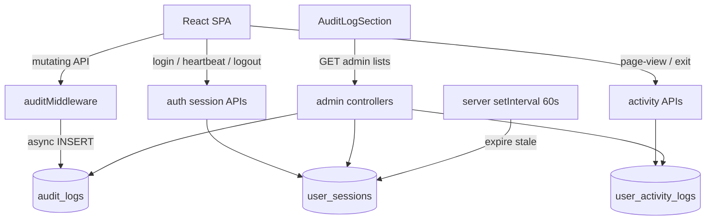

# DigiLog Audit & Activity Tracking — Technical Documentation

Evidence-based documentation of the live audit system (Change Log, Activity Log, Session Log) as implemented in the DigiLog codebase.

Related business overview: `Admin_Audit_Log_Business_Overview.docx` (generated by `scripts/generate-audit-ba-overview.js`).  
Related Word technical pack: `Admin_Audit_Log_Documentation.docx` (generated by `scripts/generate-audit-doc.js`).

---

## 1. Purpose

DigiLog records:

1. **Change Log** — who created / updated / deleted business data (API mutations).
2. **Activity Log** — who opened which section / card / form / dashboard and how long they stayed.
3. **Session Log** — login / logout, session duration, and who is online now.

Admins review all three under **Admin Config → Audit & Activity**.

---

## 2. Architecture



| Layer | Responsibility |
|-------|----------------|
| `auditMiddleware.js` | After response finish, write Change Log rows (non-blocking) |
| `utils/auditLog.js` | Sanitize body, enrich path → names, build plain-English summary |
| `utils/sessionActivity.js` | Session + activity DB helpers |
| `ActivityTracker.jsx` | Frontend session lifecycle + page dwell |
| `activityPath.js` | Map route → section / card / form labels |
| `AuditLogSection.jsx` | Three tabs + cascading filters |

---

## 3. Data model

### 3.1 `audit_logs` (Change Log)

Written only for `POST` / `PUT` / `PATCH` / `DELETE` that are not skipped.

Key columns: `user_*`, `method`, `path`, `status_code`, `success`, `action_type`, `action_summary`, `module`, `module_key`, `resource_*`, `display_path`, `screen`, `duration_ms`, `request_body`, `ip`, `user_agent`.

### 3.2 `user_sessions` (Session Log)

One row per SPA tracking session (UUID `session_id`).

| Column | Role |
|--------|------|
| `login_at` / `logout_at` | Session bounds |
| `duration_minutes` | Precomputed length |
| `is_active` | Online flag |
| `last_heartbeat` | Keep-alive; stale sessions expire after 5 minutes |
| `pages_visited` | Incremented on page/section/form/dashboard events |

### 3.3 `user_activity_logs` (Activity Log)

| Column | Role |
|--------|------|
| `session_id` | Links to `user_sessions` |
| `event_type` | `page_view`, `section_open`, `form_open`, `dashboard_open`, … |
| `section` / `card` / `form_or_dashboard` | Cascading filter dimensions |
| `page_path` / `display_path` | Technical + breadcrumb paths |
| `entered_at` / `exited_at` / `dwell_seconds` | Time on page |

Schema sources:

- `mysql/init.sql`
- Migration: `backend/prisma/migrations/20260805120000_user_sessions_activity/migration.sql`

---

## 4. APIs

### 4.1 SPA (authenticated)

| Method | Path | Purpose |
|--------|------|---------|
| POST | `/api/auth/session/start` | Create `user_sessions` row; returns `{ session_id }` |
| POST | `/api/auth/session/heartbeat` | Touch `last_heartbeat` |
| POST | `/api/auth/logout` | Close open activities + end session |
| POST | `/api/activity/page-view` | Insert activity (body may set `event_type`) |
| POST | `/api/activity/event` | Same as page-view |
| PATCH | `/api/activity/:id/exit` | Set `exited_at` + `dwell_seconds` |

Header: `X-Session-Id` (also accepted in body as `session_id`).

These write paths are **excluded** from Change Log noise in `shouldSkipAudit()`.

### 4.2 Admin (role `admin`)

| Method | Path | Purpose |
|--------|------|---------|
| GET | `/api/admin/audit-logs` | Change Log list (`q`, `action`, `success`, `from`, `to`, `module`, `screen`, `resource_name`, paging) |
| GET | `/api/admin/activity-logs` | Activity list (`section`, `card`, `form_or_dashboard`, …) |
| GET | `/api/admin/sessions` | Session list (`active`, …) |
| GET | `/api/admin/audit-filter-options` | Cascading options (`source=activity\|audit`, then `section`, `card`) |

---

## 5. Change Log pipeline

1. `shouldSkipAudit` — skip GETs, health, admin list reads, activity/session bookkeeping, hierarchy `/link` & `/sync-name`.
2. For `…/specs` PUTs: `captureSpecsBefore` so the summary can diff subsection names.
3. On `res.finish`: `setImmediate` → sanitize body → `enrichAuditContext` → `buildChangeDescription` → INSERT.

Failures in audit insert never fail the original request.

---

## 6. Session lifecycle

1. **Login / restore** — SPA calls `POST /auth/session/start`; stores `session_id` in `sessionStorage` + `localStorage` (`digilog_session_id`).
2. **Heartbeat** — every 60s `POST /auth/session/heartbeat`; `pagehide` uses `navigator.sendBeacon` when possible.
3. **Logout** — `POST /auth/logout` then clear JWT / session id (AuthContext).
4. **Stale expiry** — `server.js` interval every 60s marks sessions inactive when `last_heartbeat` older than 5 minutes.

JWT auth remains independent of tracking sessions (JWT can outlive an expired tracking session; tracker will start a new one).

---

## 7. Activity / dwell tracking

`ActivityTracker` (under `AuthProvider` + `BrowserRouter`):

1. Ensures a tracking session while `user` is set.
2. On route change: exit previous activity (`PATCH …/exit` with client dwell), then `POST /activity/page-view` with labels from `classifyPath()`.
3. `classifyPath` maps paths such as `/forms-hub`, `/bi/…`, `/power-plant-equipment-new/…`, `/sugar-house-equipment-new/…`, `/admin/config?section=…` into business section/card/form labels.

---

## 8. Admin UI

File: `frontend/src/components/admin/config/AuditLogSection.jsx`  
Config tab id: `audit-log` (label **Audit & Activity**).

| Tab | Data |
|-----|------|
| Change Log | Create / Update / Delete with expandable sanitized body |
| Activity Log | Section / card / form + dwell |
| Session Log | Login / logout / duration / online |

Cascading filters:

- Activity: Section → Card → Form / Dashboard (from `user_activity_logs`).
- Change Log: Module → Screen → Resource (from `audit_logs.module` / `screen` / `resource_name`).

---

## 9. Production apply

From `DigiLog/backend` (with production `.env`):

```bash
# Create / enrich change-log table (if not already)
node scripts/apply-sql-file.js prisma/migrations/20260730123000_audit_logs/migration.sql
node scripts/enrich-audit-logs-columns.js

# Session + activity tables
node scripts/apply-sql-file.js prisma/migrations/20260805120000_user_sessions_activity/migration.sql
```

Deploy backend + frontend so middleware, new routes, and `ActivityTracker` are live.

---

## 10. Regenerate Word docs

From `DigiLog` (requires `docx` dependency at repo root):

```bash
node scripts/generate-audit-doc.js
node scripts/generate-audit-ba-overview.js
```

Outputs:

- `Admin_Audit_Log_Documentation.docx`
- `Admin_Audit_Log_Business_Overview.docx`

---

## 11. Source file index

| Path | Role |
|------|------|
| `backend/middleware/auditMiddleware.js` | Change Log writer |
| `backend/utils/auditLog.js` | Enrichment + skip rules |
| `backend/utils/sessionActivity.js` | Session/activity DB ops |
| `backend/controllers/auditLog.controller.js` | Change Log list |
| `backend/controllers/sessionActivity.controller.js` | Session/activity writes |
| `backend/controllers/activityAdmin.controller.js` | Admin activity/session/filters |
| `backend/routes/activity.routes.js` | `/api/activity/*` |
| `backend/routes/auth.routes.js` | `/session/*`, `/logout` |
| `backend/server.js` | Mount routes + stale session sweeper |
| `frontend/src/components/ActivityTracker.jsx` | Client tracker |
| `frontend/src/utils/activityPath.js` | Route classification |
| `frontend/src/context/AuthContext.jsx` | Start/end session on login/logout |
| `frontend/src/api/axios.js` | `X-Session-Id` header |
| `frontend/src/components/admin/config/AuditLogSection.jsx` | Admin UI |

---

## 12. Known gaps / follow-ups

- Optional `data-track` button-click analytics (schema supports `element_id` / `element_label`; UI not wired yet).
- Export CSV/Excel for filtered logs.
- Retention / archival jobs.
- Richer form-key → friendly name map beyond `activityPath.js` heuristics.
- `actions_performed` on `user_sessions` is reserved; not yet incremented from Change Log inserts.
