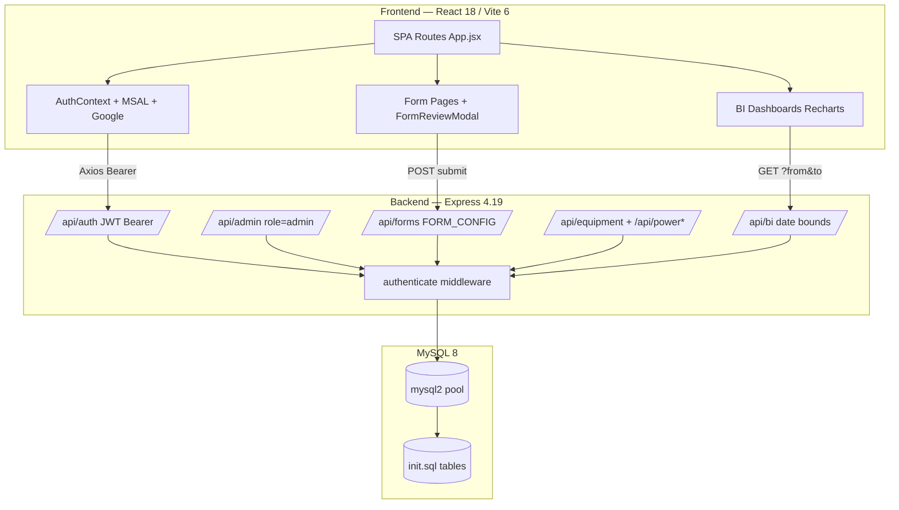

# DigiLog Technical Documentation

**Zuari Industries — Digital Operations Platform**

Document Version: 1.0  

Date: 03 July 2026  

Audience: Developers, DevOps Engineers, Security Auditors, System Maintainers

---

## Document Control

| Item | Details |
| --- | --- |
| Document Title | DigiLog Technical Documentation |
| System Name | DigiLog — Digital Logbook Platform |
| Organization | Zuari Industries |
| Purpose | Technical reference for architecture, APIs, database, deployment, and maintenance |
| Classification | Internal — Technical Use |
| Repository | C:\vivek\PLANT\DigiLog |

## 1. Project Overview

DigiLog is Zuari Industries' plant-wide digital logbook and operations platform. It replaces paper registers with a React single-page application backed by an Express REST API and MySQL 8 database.

### 1.1 Repository Layout

- `frontend/` — React 18 SPA (Vite dev server port 5173)
- `backend/` — Express API (default port 5000)
- `mysql/` — init.sql baseline schema and migrate_*.sql patches
- `scripts/` — Python/Node utilities including this documentation generator
- `docs/` — Generated documentation outputs

### 1.2 Key Technical Characteristics

| Characteristic | Implementation |
| --- | --- |
| API style | REST JSON under `/api/*` prefix |
| Auth | JWT Bearer tokens (7d default); roles `admin` | `employee` |
| Data access | mysql2 raw SQL at runtime; Prisma for migrations only |
| Access control | mappings, mapping_forms, user_homepage_cards, user_data_upload_access |
| Form workflow | FormReviewModal = pre-submit self-certification only |
| Deployment | No Docker in repo; Node + MySQL + static Vite build |

## 2. System Architecture

### 2.1 Three-Tier Architecture (Mermaid)

### 2.2 Request Flow — Form Submit

1. Employee opens `/forms/<formKey>`.
2. Submit → `FormReviewModal` read-only summary.
3. Confirm & Commit → `POST /api/forms/:formKey`.
4. Axios attaches `Authorization: Bearer <JWT>`.
5. `authenticate` middleware validates token.
6. `canAccessForm` checks mappings/mapping_forms.
7. `injectDateCols` applies pattern A–H columns.
8. `hasDuplicateOperationRow` blocks duplicates (single submit).
9. INSERT into target table; 201 response.

### 2.3 Portal Separation

`enforceAdminPortalRules` in auth.controller.js blocks cross-portal login. SSO users must be pre-provisioned in the `users` table.

## 3. Technology Stack

| Layer | Technology | Version / Notes |
| --- | --- | --- |
| Frontend | React + Vite + Tailwind | 18.3 / 6.4 / 3.4 |
| HTTP / Auth UI | Axios + MSAL + Google OAuth | 1.7 / 3.14 / 0.12 |
| Charts | Recharts | 3.8 |
| Backend | Express + mysql2 | 4.19 / 3.10 |
| Migrations | Prisma | 7.8 (@@ignore models) |
| Security | helmet + rate-limit + bcrypt + JWT | 8.2 / 7.3 |
| Upload / Email | multer + nodemailer | 2.1 / 6.9 |
| Database | MySQL | 8.x utf8mb4 |

## 4. Folder Structure

| Path | Purpose |
| --- | --- |
| `frontend/src/App.jsx` | All React routes |
| `frontend/src/pages/` | Page components |
| `frontend/src/components/` | Shared UI including FormReviewModal |
| `frontend/src/hooks/` | useAuth, useFormMeta, usePowerPlantHierarchy, etc. |
| `frontend/src/context/AuthContext.jsx` | JWT + MSAL + Google session |
| `backend/server.js` | Express bootstrap |
| `backend/routes/` | 10 route modules |
| `backend/controllers/` | Business logic |
| `mysql/init.sql` | Baseline schema (~49 tables) |
| `mysql/migrate_*.sql` | 23 incremental SQL patches |

## 5. Frontend Documentation

### 5.1 Routes (App.jsx)

Public: `/`, `/admin/login`, `/operations-desk`. Protected: `/dashboard`, `/forms-hub`, `/bi/*`, `/forms/*` (24 form keys), `/equipment/*`, `/power/*`, `/power-plant-equipment-new/*`, `/ehs/*`, `/production/*`, `/data-upload`. Admin-only: `/admin/employees`.

### 5.2 Components

- `ProtectedRoute` — auth + optional `requiredRole='admin'`
- `FormReviewModal` — pre-submit review (not approval workflow)
- `FormTable` — View Data modal + CSV export (limit 10000)
- `PowerPlantHierarchyExplorer` — PPN tree UI
- `DistilleryChartsGrid` / `MillRawDataTable` — BI visualizations

### 5.3 Hooks & Context

| Module | Purpose |
| --- | --- |
| `AuthContext.jsx` | JWT, loginManual, MSAL redirect, Google login, logout |
| `useAuth.js` | Auth context consumer |
| `useGsmaFormReview.js` | Submit → review modal → API POST |
| `useFormMeta.js` | Form metadata from API |
| `usePowerPlantHierarchy.js` | PPN hierarchy tree |
| `useDataUploadAccess.js` | Upload permission gate |

## 6. Backend Documentation

### 6.1 server.js

- helmet, cors, json 10mb, global + login rate limiters
- Mounts `/api/auth`, `/api/admin`, `/api/apps`, `/api/forms`, `/api/equipment`, `/api/power`, `/api/power-new`, `/api/bi`, `/api/homepage-cards`, `/api/data-upload`
- Global error handler with `mapDbError`

### 6.2 Controllers

auth, admin, form (FORM_CONFIG), app, equipment, power, powerNew, ppnHierarchy, bi, biSettings, homepageCards, dataUpload.

## 7. API Documentation

All endpoints under `/api/*`. Full listing:

| Method | Endpoint | Auth | Description |
| --- | --- | --- | --- |
| POST | /api/auth/login | Public (login rate-limited) | Email/password login; adminPortal flag for admin portal |
| POST | /api/auth/outlook | Public | Microsoft SSO — exchanges MSAL access token for JWT |
| POST | /api/auth/google | Public | Google SSO — verifies ID token, returns JWT |
| GET | /api/auth/me | Bearer | Current user profile from JWT |
| GET | /api/auth/users/:userId/avatar | Bearer | Stream user avatar image (authenticated) |
| POST | /api/auth/me/avatar | Bearer + multipart | Upload/crop profile avatar (multer) |
| DELETE | /api/auth/me/avatar | Bearer | Remove profile avatar |
| GET | /api/admin/users | Bearer admin | List all users |
| POST | /api/admin/users | Bearer admin | Create employee/admin user |
| PUT | /api/admin/users/:id | Bearer admin | Update user fields, role, active status |
| DELETE | /api/admin/users/:id | Bearer admin | Delete user |
| PUT | /api/admin/users/:id/manager | Bearer admin | Assign reporting manager (informational) |
| POST | /api/admin/users/:id/send-mail | Bearer admin | Send activation email with temp password (local only) |
| POST | /api/admin/users/send-mail-bulk | Bearer admin | Bulk activation emails |
| GET | /api/admin/mappings | Bearer admin | All user→app mappings with form restrictions |
| POST | /api/admin/mappings | Bearer admin | Upsert mapping + mapping_forms |
| DELETE | /api/admin/mappings/:id | Bearer admin | Remove mapping |
| GET | /api/admin/apps-all | Bearer admin | All apps with nested forms (for mapping UI) |
| GET | /api/admin/bi-settings | Bearer admin | Read portal_settings BI toggles |
| PUT | /api/admin/bi-settings | Bearer admin | Update BI settings (e.g. third season compare) |
| GET | /api/admin/data-upload-access | Bearer admin | List employees with data upload grant |
| PUT | /api/admin/data-upload-access | Bearer admin | Grant/revoke data upload access |
| GET | /api/apps | Bearer | Apps accessible to current user (respects mappings) |
| GET | /api/forms/:formKey | Bearer + mapping | Form metadata (name, description) |
| GET | /api/forms/:formKey/records | Bearer + mapping | Paginated records (?page, ?limit≤10000) |
| POST | /api/forms/:formKey | Bearer + mapping | Single submit with duplicate detection |
| POST | /api/forms/:formKey/batch | Bearer + mapping | Batch insert (prod pan/decanter/clarification) |
| GET | /api/equipment | Bearer | List mh_equipment |
| GET | /api/equipment/:id | Bearer | Equipment detail with specs/schedule |
| PUT | /api/equipment/:id | Bearer | Update equipment header fields |
| PUT | /api/equipment/:id/image/:type | Bearer + multipart | Upload photo/plate (type=photo|plate) |
| DELETE | /api/equipment/:id/image/:type | Bearer | Remove equipment image |
| PUT | /api/equipment/:id/specs | Bearer | Replace specification rows |
| PUT | /api/equipment/:id/schedule | Bearer | Replace OEM schedule rows |
| GET | /api/equipment/:id/history | Bearer | Maintenance history timeline |
| POST | /api/equipment/:id/history | Bearer | Add history entry |
| PUT | /api/equipment/:id/history/:hid | Bearer | Update history entry |
| DELETE | /api/equipment/:id/history/:hid | Bearer | Delete history entry |
| GET | /api/power/lookup | Bearer | Search equipment by tag/name within dept |
| GET | /api/power | Bearer | List pp_equipment (filter by dept query) |
| POST | /api/power | Bearer | Create pp_equipment |
| GET | /api/power/:id | Bearer | Equipment detail |
| PUT | /api/power/:id | Bearer | Update equipment |
| PUT | /api/power/:id/image/:type | Bearer + multipart | Upload image |
| DELETE | /api/power/:id/image/:type | Bearer | Delete image |
| PUT | /api/power/:id/specs | Bearer | Update specs |
| PUT | /api/power/:id/schedule | Bearer | Update OEM schedule |
| GET | /api/power/:id/history | Bearer | History list |
| POST | /api/power/:id/history | Bearer | Add history |
| PUT | /api/power/:id/history/:hid | Bearer | Update history |
| DELETE | /api/power/:id/history/:hid | Bearer | Delete history |
| GET | /api/power-new/lookup | Bearer | Hierarchy-aware equipment lookup |
| GET | /api/power-new/hierarchy | Bearer | Full ppn_hierarchy_node tree |
| GET | /api/power-new/hierarchy/path/:nodeId | Bearer | Breadcrumb path to node |
| POST | /api/power-new/hierarchy | Bearer | Create hierarchy node |
| PUT | /api/power-new/hierarchy/:nodeId | Bearer | Rename/reparent node (protected seeds blocked) |
| DELETE | /api/power-new/hierarchy/:nodeId | Bearer | Delete node (protected seeds blocked) |
| GET | /api/power-new | Bearer | List ppn_equipment |
| POST | /api/power-new | Bearer | Create ppn_equipment |
| GET | /api/power-new/:id | Bearer | Equipment detail with section-scoped specs |
| PUT | /api/power-new/:id | Bearer | Update equipment |
| PUT | /api/power-new/:id/image/:type | Bearer + multipart | Upload image |
| DELETE | /api/power-new/:id/image/:type | Bearer | Delete image |
| PUT | /api/power-new/:id/specs | Bearer | Update specs (section/sub_section) |
| PUT | /api/power-new/:id/schedule | Bearer | Update OEM schedule |
| DELETE | /api/power-new/:id/history-sub-group | Bearer | Delete scoped history sub-group |
| PUT | /api/power-new/:id/history-sub-group/rename | Bearer | Rename history sub-group |
| GET | /api/power-new/:id/history | Bearer | History (optionally scoped by section) |
| POST | /api/power-new/:id/history | Bearer | Add history entry |
| PUT | /api/power-new/:id/history/:hid | Bearer | Update history |
| DELETE | /api/power-new/:id/history/:hid | Bearer | Delete history |
| GET | /api/bi/settings | Bearer | Employee-readable BI portal settings |
| GET | /api/bi/distillery-operations | Bearer + mapping | Distillery analytics (?from, ?to ISO dates) |
| GET | /api/bi/milling-operations | Bearer + mapping | Mill stoppage/outage analytics |
| GET | /api/bi/milling-equipment-temp | Bearer + mapping | Equipment temperature BI series |
| GET | /api/bi/milling-shredder | Bearer + mapping | Shredder/OTG BI series |
| GET | /api/bi/milling-lube-roller | Bearer + mapping | Lube pressure & roller temp BI series |
| GET | /api/homepage-cards | Bearer | user_homepage_cards for current user |
| GET | /api/data-upload/access | Bearer | Whether current user has upload access |
| GET | /api/data-upload/files | Bearer + upload access | List uploaded files with uploader audit |
| POST | /api/data-upload | Bearer + upload access + multipart | Upload CSV/XLS/XLSX (max DATA_UPLOAD_MAX_BYTES) |
| GET | /api/data-upload/files/:id/download | Bearer + upload access | Download stored file |
| DELETE | /api/data-upload/files/:id | Bearer + upload access | Delete own upload |
| GET | /api/health | Public | Liveness probe { status: ok } |

## 8. Database Documentation

### 8.1 Schema Management

- Runtime: mysql2 raw SQL (Prisma Client not used)
- Baseline: `mysql/init.sql` via `npm run db:schema`
- Patches: 23 `migrate_*.sql` files
- Prisma migrations track form/logbook evolution
- Schema drift possible between init.sql, migrate_*.sql, and Prisma — verify before deploy

### 8.2 Tables (49)

| Table | Domain | Description |
| --- | --- | --- |
| users | System | Accounts: email, bcrypt password, role admin|employee, auth_provider local|outlook|google, manager_id, avatar |
| apps | System | Registered applications (Mill Logbook, Lab, BI Control Tower, etc.) |
| forms | System | Form registry linked to apps via app_id; form_key drives FORM_CONFIG |
| mappings | System | user_id + app_id — grants app access to employee |
| mapping_forms | System | Optional per-form restriction within a mapping; empty = all forms in app |
| portal_settings | System | Key/value admin settings (bi_third_season_compare) |
| user_homepage_cards | System | card_key forms_hub | bi_control_tower for /dashboard |
| user_data_upload_access | System | Admin-granted flag for Data Ingestion Center |
| data_upload_files | System | Uploaded file registry with uploader audit trail |
| mill_logbook1 | Mill | Equipment motor/gear/bearing temperatures by mill section |
| mill_logbook2 | Mill | Shredder vibration/OTG readings |
| mill_logbook3 | Mill | Lube pressures and roller temperatures |
| mill_stoppages | Mill | Mill downtime events: section, machinery, remarks |
| ds_logbook | Lab | Double Sulphitation pol/brix measurements |
| rs_logbook | Lab | Refinery Sulphitation analysis incl. IU/pH fields |
| ops_logbook | Lab | Operations crush, imbibe, bagging, FBD readings |
| sa_logbook | Lab | Special analysis retention/moisture/colour |
| syrp_logbook | Lab | Syrup production and TRS metrics |
| stoppage_logbook | Lab | Lab department stoppages |
| ph_power | Power | Generation, export, import, consumption by unit |
| ph_steam | Power | Steam generation and consumption balance |
| ph_stoppage | Power | Power house stoppages with category |
| pp_equipment | Power Equipment | Legacy dept-based equipment cards (electrical/instrument/mechanical) |
| pp_specs | Power Equipment | Label/value specification rows per pp_equipment |
| pp_oem_schedule | Power Equipment | OEM maintenance interval matrix |
| pp_history | Power Equipment | Maintenance timeline with before/after images |
| ppn_equipment | Power Equipment New | Hierarchy-linked equipment records |
| ppn_specs | Power Equipment New | Section/sub_section scoped specifications |
| ppn_oem_schedule | Power Equipment New | Scoped OEM schedule with equipment_refs JSON |
| ppn_history | Power Equipment New | Scoped maintenance history with equipment_refs |
| ppn_hierarchy_node | Power Equipment New | Tree nodes (group|equipment) for 150TPH/70TPH/WTP areas |
| mh_equipment | Mill House Equipment | Mill house asset registry |
| mh_specs | Mill House Equipment | Equipment specifications |
| mh_oem_schedule | Mill House Equipment | OEM schedule per asset |
| mh_history | Mill House Equipment | Maintenance history with images |
| distillery_operations | Distillery | Daily ops snapshot; generated columns FS%, total_mol_in_store_qtls |
| ehs_near_miss | EHS | Near miss/incident reports with HOD text fields |
| ehs_accident | EHS | Accident register (not exposed in App.jsx menu) |
| ehs_water_gwa | EHS | Ground water abstraction meters and allocation |
| ehs_water_etp | EHS | ETP inlet/outlet quality and flow |
| ehs_water_cpu | EHS | CPU recycle water quality (pH per shift) |
| prod_shift_chemist | Production | Shift chemist instructions and job logs |
| prod_centrifugal | Production | Centrifugal machine stoppages M1–M4 |
| prod_pan_logbook | Production | Pan strike records (batch submit) |
| prod_decanter | Production | Decanter hourly readings ST1/ST2 (batch submit) |
| prod_clarification | Production | Clarification process readings (batch submit) |
| data_mill_mapping | BI Reference | Mill thermal variable→equipment mapping for BI reports |
| data_shredder_mapping | BI Reference | Shredder variable mapping |
| data_lube_mapping | BI Reference | Lube/roller variable mapping |

### 8.3 Access Control Tables

| Table | Relationship |
| --- | --- |
| `mappings` | user_id → app_id |
| `mapping_forms` | Optional form_id restriction per mapping |
| `user_homepage_cards` | Dashboard card visibility |
| `user_data_upload_access` | Data Ingestion Center grant |

### 8.4 Complete Table Schemas (Column-Level)

Full column definitions for all **49** application tables, sourced from `backend/backup_before_reconcile.sql`. Logbook tables typically have no PRIMARY KEY; duplicate prevention uses application-layer operational keys.

#### Domain: System

##### Table: `apps`

**Business purpose:** Registered applications (Mill Logbook, Lab, BI Control Tower, etc.)

**Storage:** Engine=InnoDB

| Column | Data Type | Nullable | Default | Extra |
| --- | --- | --- | --- | --- |
| id | int | NO | - | AUTO_INCREMENT |
| name | varchar(200) | NO | - | - |
| description | varchar(500) | YES | NULL | - |
| icon | varchar(100) | YES | NULL | - |
| color | varchar(20) | YES | NULL | - |
| sort_order | int | NO | '0' | - |
| is_active | tinyint(1) | NO | '1' | - |
| created_at | timestamp | YES | CURRENT_TIMESTAMP | - |

**Keys & constraints:**

- PRIMARY KEY (id)
- UNIQUE KEY `name` (`name`)

##### Table: `data_upload_files`

**Business purpose:** Uploaded file registry with uploader audit trail

**Storage:** Engine=InnoDB

| Column | Data Type | Nullable | Default | Extra |
| --- | --- | --- | --- | --- |
| id | int | NO | - | AUTO_INCREMENT |
| user_id | int | NO | - | - |
| category | varchar(200) | NO | - | - |
| original_filename | varchar(255) | NO | - | - |
| stored_filename | varchar(255) | NO | - | - |
| mime_type | varchar(128) | YES | NULL | - |
| file_size_bytes | bigint unsigned | NO | '0' | - |
| created_at | timestamp | NO | CURRENT_TIMESTAMP | - |

**Keys & constraints:**

- PRIMARY KEY (id)
- UNIQUE KEY `uq_stored_filename` (`stored_filename`)
- KEY `user_id` (`user_id`)
- KEY `idx_data_upload_created` (`created_at` DESC)
- CONSTRAINT `data_upload_files_ibfk_1` FOREIGN KEY (`user_id`) REFERENCES `users` (`id`) ON DELETE CASCADE

##### Table: `forms`

**Business purpose:** Form registry linked to apps via app_id; form_key drives FORM_CONFIG

**Storage:** Engine=InnoDB

| Column | Data Type | Nullable | Default | Extra |
| --- | --- | --- | --- | --- |
| id | int | NO | - | AUTO_INCREMENT |
| name | varchar(200) | NO | - | - |
| description | varchar(500) | YES | NULL | - |
| form_key | varchar(100) | NO | - | - |
| app_id | int | NO | - | - |
| sort_order | int | NO | '0' | - |
| is_active | tinyint(1) | NO | '1' | - |
| created_at | timestamp | YES | CURRENT_TIMESTAMP | - |

**Keys & constraints:**

- PRIMARY KEY (id)
- UNIQUE KEY `form_key` (`form_key`)
- KEY `app_id` (`app_id`)
- CONSTRAINT `forms_ibfk_1` FOREIGN KEY (`app_id`) REFERENCES `apps` (`id`) ON DELETE CASCADE

##### Table: `mapping_forms`

**Business purpose:** Optional per-form restriction within a mapping; empty = all forms in app

**Storage:** Engine=InnoDB

| Column | Data Type | Nullable | Default | Extra |
| --- | --- | --- | --- | --- |
| mapping_id | int | NO | - | - |
| form_id | int | NO | - | - |

**Keys & constraints:**

- PRIMARY KEY (mapping_id, form_id)
- KEY `form_id` (`form_id`)
- CONSTRAINT `mapping_forms_ibfk_1` FOREIGN KEY (`mapping_id`) REFERENCES `mappings` (`id`) ON DELETE CASCADE
- CONSTRAINT `mapping_forms_ibfk_2` FOREIGN KEY (`form_id`) REFERENCES `forms` (`id`) ON DELETE CASCADE

##### Table: `mappings`

**Business purpose:** user_id + app_id — grants app access to employee

**Storage:** Engine=InnoDB

| Column | Data Type | Nullable | Default | Extra |
| --- | --- | --- | --- | --- |
| id | int | NO | - | AUTO_INCREMENT |
| user_id | int | NO | - | - |
| app_id | int | NO | - | - |
| created_at | timestamp | YES | CURRENT_TIMESTAMP | - |

**Keys & constraints:**

- PRIMARY KEY (id)
- UNIQUE KEY `uq_user_app` (`user_id`,`app_id`)
- KEY `app_id` (`app_id`)
- CONSTRAINT `mappings_ibfk_1` FOREIGN KEY (`user_id`) REFERENCES `users` (`id`) ON DELETE CASCADE
- CONSTRAINT `mappings_ibfk_2` FOREIGN KEY (`app_id`) REFERENCES `apps` (`id`) ON DELETE CASCADE

##### Table: `portal_settings`

**Business purpose:** Key/value admin settings (bi_third_season_compare)

**Storage:** Engine=InnoDB

| Column | Data Type | Nullable | Default | Extra |
| --- | --- | --- | --- | --- |
| setting_key | varchar(64) | NO | - | - |
| setting_value | varchar(255) | NO | - | - |
| updated_at | timestamp | NO | CURRENT_TIMESTAMP | ON UPDATE CURRENT_TIMESTAMP |

**Keys & constraints:**

- PRIMARY KEY (setting_key)

##### Table: `user_data_upload_access`

**Business purpose:** Admin-granted flag for Data Ingestion Center

**Storage:** Engine=InnoDB

| Column | Data Type | Nullable | Default | Extra |
| --- | --- | --- | --- | --- |
| user_id | int | NO | - | - |
| granted_by | int | YES | NULL | - |
| created_at | timestamp | NO | CURRENT_TIMESTAMP | - |

**Keys & constraints:**

- PRIMARY KEY (user_id)
- KEY `granted_by` (`granted_by`)
- CONSTRAINT `user_data_upload_access_ibfk_1` FOREIGN KEY (`user_id`) REFERENCES `users` (`id`) ON DELETE CASCADE
- CONSTRAINT `user_data_upload_access_ibfk_2` FOREIGN KEY (`granted_by`) REFERENCES `users` (`id`) ON DELETE SET NULL

##### Table: `user_homepage_cards`

**Business purpose:** card_key forms_hub | bi_control_tower for /dashboard

**Storage:** Engine=InnoDB

| Column | Data Type | Nullable | Default | Extra |
| --- | --- | --- | --- | --- |
| user_id | int | NO | - | - |
| card_key | varchar(32) COLLATE utf8mb4_unicode_ci | NO | - | - |
| created_at | timestamp | NO | CURRENT_TIMESTAMP | - |

**Keys & constraints:**

- PRIMARY KEY (user_id, card_key)
- KEY `user_homepage_cards_user_id_idx` (`user_id`)
- CONSTRAINT `user_homepage_cards_user_id_fkey` FOREIGN KEY (`user_id`) REFERENCES `users` (`id`) ON DELETE CASCADE ON UPDATE CASCADE

##### Table: `users`

**Business purpose:** Accounts: email, bcrypt password, role admin|employee, auth_provider local|outlook|google, manager_id, avatar

**Storage:** Engine=InnoDB

| Column | Data Type | Nullable | Default | Extra |
| --- | --- | --- | --- | --- |
| id | int | NO | - | AUTO_INCREMENT |
| name | varchar(200) | NO | - | - |
| email | varchar(200) | NO | - | - |
| password | varchar(200) | YES | NULL | - |
| role | enum('admin','employee') | NO | 'employee' | - |
| is_active | tinyint(1) | NO | '1' | - |
| auth_provider | varchar(20) | NO | 'local' | - |
| mail_sent | tinyint(1) | NO | '0' | - |
| microsoft_id | varchar(200) | YES | NULL | - |
| created_at | timestamp | YES | CURRENT_TIMESTAMP | - |
| updated_at | timestamp | YES | CURRENT_TIMESTAMP | ON UPDATE CURRENT_TIMESTAMP |
| department | varchar(255) | YES | NULL | - |
| avatar | mediumtext | YES | - | - |
| google_id | varchar(200) | YES | NULL | - |
| manager_id | int | YES | NULL | - |

**Keys & constraints:**

- PRIMARY KEY (id)
- UNIQUE KEY `email` (`email`)
- KEY `users_manager_id_fkey` (`manager_id`)
- CONSTRAINT `users_manager_id_fkey` FOREIGN KEY (`manager_id`) REFERENCES `users` (`id`) ON DELETE SET NULL ON UPDATE CASCADE

#### Domain: Mill Logbook

##### Table: `mill_logbook1`

**Business purpose:** Equipment motor/gear/bearing temperatures by mill section

**Storage:** Engine=InnoDB

| Column | Data Type | Nullable | Default | Extra |
| --- | --- | --- | --- | --- |
| Date | date | YES | NULL | - |
| Shift | varchar(10) | YES | NULL | - |
| Time | datetime | YES | NULL | - |
| CaneKeig_MtrTemp | double | YES | NULL | - |
| CaneKeig_GearTempDE | double | YES | NULL | - |
| CaneKeig_GearTempNDE | double | YES | NULL | - |
| CaneKeig_BearTempDE | double | YES | NULL | - |
| CaneKeig_BearTempNDE | double | YES | NULL | - |
| CardDrum1_MtrTemp | double | YES | NULL | - |
| CardDrum1_GearTempDE | double | YES | NULL | - |
| CardDrum1_GearTempNDE | double | YES | NULL | - |
| CardDrum1_BearTempDE | double | YES | NULL | - |
| CardDrum1_BearTempNDE | double | YES | NULL | - |
| CardDrum2_MtrTemp | double | YES | NULL | - |
| CardDrum2_GearTempDE | double | YES | NULL | - |
| CardDrum2_GearTempNDE | double | YES | NULL | - |
| CardDrum2_BearTempDE | double | YES | NULL | - |
| CardDrum2_BearTempNDE | double | YES | NULL | - |
| FeedDrum_MtrTemp | double | YES | NULL | - |
| FeedDrum_GearTempDE | double | YES | NULL | - |
| FeedDrum_GearTempNDE | double | YES | NULL | - |
| FeedDrum_BearTempDE | double | YES | NULL | - |
| FeedDrum_BearTempNDE | double | YES | NULL | - |
| CaneCar_MtrTemp | double | YES | NULL | - |
| CaneCar_GearTempDE | double | YES | NULL | - |
| CaneCar_GearTempNDE | double | YES | NULL | - |
| CaneCar_BearTempDE | double | YES | NULL | - |
| CaneCar_BearTempNDE | double | YES | NULL | - |
| ShredCar_MtrTemp | double | YES | NULL | - |
| ShredCar_GearTempDE | double | YES | NULL | - |
| ShredCar_GearTempNDE | double | YES | NULL | - |
| ShredCar_BearTempDE | double | YES | NULL | - |
| ShredCar_BearTempNDE | double | YES | NULL | - |
| BeltConvy_MtrTemp | double | YES | NULL | - |
| BeltConvy_GearTempDE | double | YES | NULL | - |
| BeltConvy_GearTempNDE | double | YES | NULL | - |
| BeltConvy_BearTempDE | double | YES | NULL | - |
| BeltConvy_BearTempNDE | double | YES | NULL | - |
| IRC1_MtrTemp | double | YES | NULL | - |
| IRC1_GearTempDE | double | YES | NULL | - |
| IRC1_GearTempNDE | double | YES | NULL | - |
| IRC1_BearTempDE | double | YES | NULL | - |
| IRC1_BearTempNDE | double | YES | NULL | - |
| IRC2_MtrTemp | double | YES | NULL | - |
| IRC2_GearTempDE | double | YES | NULL | - |
| IRC2_GearTempNDE | double | YES | NULL | - |
| IRC2_BearTempDE | double | YES | NULL | - |
| IRC2_BearTempNDE | double | YES | NULL | - |
| IRC3_MtrTemp | double | YES | NULL | - |
| IRC3_GearTempDE | double | YES | NULL | - |
| IRC3_GearTempNDE | double | YES | NULL | - |
| IRC3_BearTempDE | double | YES | NULL | - |
| IRC3_BearTempNDE | double | YES | NULL | - |
| IRC4_MtrTemp | double | YES | NULL | - |
| IRC4_GearTempDE | double | YES | NULL | - |
| IRC4_GearTempNDE | double | YES | NULL | - |
| IRC4_BearTempDE | double | YES | NULL | - |
| IRC4_BearTempNDE | double | YES | NULL | - |
| Mill0_MtrTemp | double | YES | NULL | - |
| Mill0_GearTempDE | double | YES | NULL | - |
| Mill0_GearTempNDE | double | YES | NULL | - |
| Mill0_BearTempDE | double | YES | NULL | - |
| Mill0_BearTempNDE | double | YES | NULL | - |
| Mill4_MtrTemp | double | YES | NULL | - |
| Mill4_GearTempDE | double | YES | NULL | - |
| Mill4_GearTempNDE | double | YES | NULL | - |
| Mill4_BearTempDE | double | YES | NULL | - |
| Mill4_BearTempNDE | double | YES | NULL | - |
| timestamp | timestamp | YES | CURRENT_TIMESTAMP | - |

*Keys: none at database level (append-only logbook pattern).*

##### Table: `mill_logbook2`

**Business purpose:** Shredder vibration/OTG readings

**Storage:** Engine=InnoDB

| Column | Data Type | Nullable | Default | Extra |
| --- | --- | --- | --- | --- |
| Date | date | YES | NULL | - |
| Shift | varchar(10) | YES | NULL | - |
| Time | datetime | YES | NULL | - |
| shredR_MtrTemp | double | YES | NULL | - |
| shredR_BearTempSite | double | YES | NULL | - |
| shredR_BearTempDCS | double | YES | NULL | - |
| shredR_VibH | double | YES | NULL | - |
| shredR_VibV | double | YES | NULL | - |
| shredR_VibA | double | YES | NULL | - |
| shredL_MtrTemp | double | YES | NULL | - |
| shredL_BearTempSite | double | YES | NULL | - |
| shredL_BearTempDCS | double | YES | NULL | - |
| shredL_VibH | double | YES | NULL | - |
| shredL_VibV | double | YES | NULL | - |
| shredL_VibA | double | YES | NULL | - |
| M1_InpT | double | YES | NULL | - |
| M1_InpM | double | YES | NULL | - |
| M1_IntT | double | YES | NULL | - |
| M1_IntM | double | YES | NULL | - |
| M1_OutT | double | YES | NULL | - |
| M1_OutM | double | YES | NULL | - |
| M2_InpT | double | YES | NULL | - |
| M2_InpM | double | YES | NULL | - |
| M2_IntT | double | YES | NULL | - |
| M2_IntM | double | YES | NULL | - |
| M2_OutT | double | YES | NULL | - |
| M2_OutM | double | YES | NULL | - |
| M3_InpT | double | YES | NULL | - |
| M3_InpM | double | YES | NULL | - |
| M3_IntT | double | YES | NULL | - |
| M3_IntM | double | YES | NULL | - |
| M3_OutT | double | YES | NULL | - |
| M3_OutM | double | YES | NULL | - |
| M4_InpT | double | YES | NULL | - |
| M4_InpM | double | YES | NULL | - |
| M4_IntT | double | YES | NULL | - |
| M4_IntM | double | YES | NULL | - |
| M4_OutT | double | YES | NULL | - |
| M4_OutM | double | YES | NULL | - |
| timestamp | timestamp | YES | CURRENT_TIMESTAMP | - |

*Keys: none at database level (append-only logbook pattern).*

##### Table: `mill_logbook3`

**Business purpose:** Lube pressures and roller temperatures

**Storage:** Engine=InnoDB

| Column | Data Type | Nullable | Default | Extra |
| --- | --- | --- | --- | --- |
| Date | date | YES | NULL | - |
| Shift | varchar(10) | YES | NULL | - |
| Time | datetime | YES | NULL | - |
| LubePressure_ACC | double | YES | NULL | - |
| LubePressure_MCC | double | YES | NULL | - |
| LubePressure_Shred | double | YES | NULL | - |
| LubePressure_M0 | double | YES | NULL | - |
| M0_gsT | double | YES | NULL | - |
| M0_gsB | double | YES | NULL | - |
| M0_gsUF | double | YES | NULL | - |
| M0_psT | double | YES | NULL | - |
| M0_psB | double | YES | NULL | - |
| M0_psUF | double | YES | NULL | - |
| M1_gsT | double | YES | NULL | - |
| M1_gsB | double | YES | NULL | - |
| M1_gsUF | double | YES | NULL | - |
| M1_psT | double | YES | NULL | - |
| M1_psB | double | YES | NULL | - |
| M1_psUF | double | YES | NULL | - |
| M2_gsT | double | YES | NULL | - |
| M2_gsB | double | YES | NULL | - |
| M2_gsUF | double | YES | NULL | - |
| M2_psT | double | YES | NULL | - |
| M2_psB | double | YES | NULL | - |
| M2_psUF | double | YES | NULL | - |
| M3_gsT | double | YES | NULL | - |
| M3_gsB | double | YES | NULL | - |
| M3_gsUF | double | YES | NULL | - |
| M3_psT | double | YES | NULL | - |
| M3_psB | double | YES | NULL | - |
| M3_psUF | double | YES | NULL | - |
| M4_gsT | double | YES | NULL | - |
| M4_gsB | double | YES | NULL | - |
| M4_gsUF | double | YES | NULL | - |
| M4_psT | double | YES | NULL | - |
| M4_psB | double | YES | NULL | - |
| M4_psUF | double | YES | NULL | - |
| timestamp | timestamp | YES | CURRENT_TIMESTAMP | - |

*Keys: none at database level (append-only logbook pattern).*

##### Table: `mill_stoppages`

**Business purpose:** Mill downtime events: section, machinery, remarks

**Storage:** Engine=InnoDB

| Column | Data Type | Nullable | Default | Extra |
| --- | --- | --- | --- | --- |
| Date | date | YES | NULL | - |
| start_time | datetime | YES | NULL | - |
| end_time | datetime | YES | NULL | - |
| section | varchar(100) | YES | NULL | - |
| machinery | varchar(200) | YES | NULL | - |
| remarks | varchar(600) | YES | NULL | - |
| timestamp | timestamp | YES | CURRENT_TIMESTAMP | - |

*Keys: none at database level (append-only logbook pattern).*

#### Domain: Lab Logbook

##### Table: `ds_logbook`

**Business purpose:** Double Sulphitation pol/brix measurements

**Storage:** Engine=InnoDB

| Column | Data Type | Nullable | Default | Extra |
| --- | --- | --- | --- | --- |
| Date | date | YES | NULL | - |
| Shift | varchar(10) | YES | NULL | - |
| Sampling_time | varchar(10) | YES | NULL | - |
| PJ_Pol | double | YES | NULL | - |
| PJ_Brix | double | YES | NULL | - |
| MJ_Pol | double | YES | NULL | - |
| MJ_Brix | double | YES | NULL | - |
| LMJ_Pol | double | YES | NULL | - |
| LMJ_Brix | double | YES | NULL | - |
| CJ_Pol | double | YES | NULL | - |
| CJ_Brix | double | YES | NULL | - |
| FJ_Pol | double | YES | NULL | - |
| FJ_Brix | double | YES | NULL | - |
| USul_Syrp_Pol | double | YES | NULL | - |
| USul_Syrp_Brix | double | YES | NULL | - |
| Sul_Syrp_Pol | double | YES | NULL | - |
| Sul_Syrp_Brix | double | YES | NULL | - |
| A_Mc_Pol | double | YES | NULL | - |
| A_Mc_Brix | double | YES | NULL | - |
| B_Mc_Pol | double | YES | NULL | - |
| B_Mc_Brix | double | YES | NULL | - |
| A1_Mc_Pol | double | YES | NULL | - |
| A1_Mc_Brix | double | YES | NULL | - |
| C_Mc_Pol | double | YES | NULL | - |
| C_Mc_Brix | double | YES | NULL | - |
| AH_Mol_Pol | double | YES | NULL | - |
| AH_Mol_Brix | double | YES | NULL | - |
| AL_Mol_Pol | double | YES | NULL | - |
| AL_Mol_Brix | double | YES | NULL | - |
| BH_Mol_Pol | double | YES | NULL | - |
| BH_Mol_Brix | double | YES | NULL | - |
| CL_Mol_Pol | double | YES | NULL | - |
| CL_Mol_Brix | double | YES | NULL | - |
| FMol_Pol | double | YES | NULL | - |
| FMol_Brix | double | YES | NULL | - |
| Bag_Pol | double | YES | NULL | - |
| Bag_Moisture | double | YES | NULL | - |
| FCake_Pol | double | YES | NULL | - |
| op_mode | varchar(10) | YES | NULL | - |
| A1_Mol_Pol | double | YES | NULL | - |
| A1_Mol_Brix | double | YES | NULL | - |
| MillDrain_Pol | double | YES | NULL | - |
| BoilHouseDrain_Pol | double | YES | NULL | - |
| timestamp | timestamp | YES | CURRENT_TIMESTAMP | - |

*Keys: none at database level (append-only logbook pattern).*

##### Table: `ops_logbook`

**Business purpose:** Operations crush, imbibe, bagging, FBD readings

**Storage:** Engine=InnoDB

| Column | Data Type | Nullable | Default | Extra |
| --- | --- | --- | --- | --- |
| Date | date | YES | NULL | - |
| Shift | varchar(10) | YES | NULL | - |
| Sampling_time | varchar(10) | YES | NULL | - |
| yard_bal | double | YES | NULL | - |
| crush | double | YES | NULL | - |
| imb_wtr | double | YES | NULL | - |
| imb_temp | double | YES | NULL | - |
| mixj_ds | double | YES | NULL | - |
| mixj_rs | double | YES | NULL | - |
| mol_ds | double | YES | NULL | - |
| mol_rs | double | YES | NULL | - |
| fcake_ds | double | YES | NULL | - |
| fcake_rs | double | YES | NULL | - |
| qty_dsl | double | YES | NULL | - |
| mesh_dsl | double | YES | NULL | - |
| bagtemp_dsl | double | YES | NULL | - |
| qty_dsm | double | YES | NULL | - |
| mesh_dsm | double | YES | NULL | - |
| bagtemp_dsm | double | YES | NULL | - |
| qty_dss | double | YES | NULL | - |
| mesh_dss | double | YES | NULL | - |
| bagtemp_dss | double | YES | NULL | - |
| qty_rsl | double | YES | NULL | - |
| mesh_rsl | double | YES | NULL | - |
| bagtemp_rsl | double | YES | NULL | - |
| qty_rsm | double | YES | NULL | - |
| mesh_rsm | double | YES | NULL | - |
| bagtemp_rsm | double | YES | NULL | - |
| qty_rss | double | YES | NULL | - |
| mesh_rss | double | YES | NULL | - |
| bagtemp_rss | double | YES | NULL | - |
| qty_p20 | double | YES | NULL | - |
| bagtemp_p20 | double | YES | NULL | - |
| qty_p30 | double | YES | NULL | - |
| bagtemp_p30 | double | YES | NULL | - |
| qty_p40 | double | YES | NULL | - |
| bagtemp_p40 | double | YES | NULL | - |
| FBDInlet_TempDS | double | YES | NULL | - |
| FBDInlet_MoistDS | double | YES | NULL | - |
| FBDOutlet_TempDS | double | YES | NULL | - |
| FBDOutlet_MoistDS | double | YES | NULL | - |
| Hopper_TempDS | double | YES | NULL | - |
| Hopper_MoistDS | double | YES | NULL | - |
| FBDInlet_TempRS | double | YES | NULL | - |
| FBDInlet_MoistRS | double | YES | NULL | - |
| FBDOutlet_TempRS | double | YES | NULL | - |
| FBDOutlet_MoistRS | double | YES | NULL | - |
| Hopper_TempRS | double | YES | NULL | - |
| Hopper_MoistRS | double | YES | NULL | - |
| RSDInlet_Temp | double | YES | NULL | - |
| RSDInlet_Moist | double | YES | NULL | - |
| RSDOutlet_Temp | double | YES | NULL | - |
| RSDOutlet_Moist | double | YES | NULL | - |
| timestamp | timestamp | YES | CURRENT_TIMESTAMP | - |

*Keys: none at database level (append-only logbook pattern).*

##### Table: `rs_logbook`

**Business purpose:** Refinery Sulphitation analysis incl. IU/pH fields

**Storage:** Engine=InnoDB

| Column | Data Type | Nullable | Default | Extra |
| --- | --- | --- | --- | --- |
| Date | date | YES | NULL | - |
| Shift | varchar(10) | YES | NULL | - |
| Sampling_time | varchar(10) | YES | NULL | - |
| CJ_Pol | double | YES | NULL | - |
| CJ_Brix | double | YES | NULL | - |
| FJ_Pol | double | YES | NULL | - |
| FJ_Brix | double | YES | NULL | - |
| UtrSyrp_Pol | double | YES | NULL | - |
| UtrSyrp_Brix | double | YES | NULL | - |
| RawMc_Pol | double | YES | NULL | - |
| RawMc_Brix | double | YES | NULL | - |
| R1Mc_Pol | double | YES | NULL | - |
| R1Mc_Brix | double | YES | NULL | - |
| R2Mc_Pol | double | YES | NULL | - |
| R2Mc_Brix | double | YES | NULL | - |
| BMc_Pol | double | YES | NULL | - |
| BMc_Brix | double | YES | NULL | - |
| CMc_Pol | double | YES | NULL | - |
| CMc_Brix | double | YES | NULL | - |
| AH_Mol_Pol | double | YES | NULL | - |
| AH_Mol_Brix | double | YES | NULL | - |
| AL_Mol_Pol | double | YES | NULL | - |
| AL_Mol_Brix | double | YES | NULL | - |
| R1_Mol_Pol | double | YES | NULL | - |
| R1_Mol_Brix | double | YES | NULL | - |
| R2_Mol_Pol | double | YES | NULL | - |
| R2_Mol_Brix | double | YES | NULL | - |
| BH_Mol_Pol | double | YES | NULL | - |
| BH_Mol_Brix | double | YES | NULL | - |
| CL_Mol_Pol | double | YES | NULL | - |
| CL_Mol_Brix | double | YES | NULL | - |
| FMol_Pol | double | YES | NULL | - |
| FMol_Brix | double | YES | NULL | - |
| FCake_Pol | double | YES | NULL | - |
| op_mode | varchar(10) | YES | NULL | - |
| R1Mc_IU | double | YES | NULL | - |
| R2Mc_IU | double | YES | NULL | - |
| R1Mol_IU | double | YES | NULL | - |
| R2Mol_IU | double | YES | NULL | - |
| RawMlt_Pol | double | YES | NULL | - |
| RawMlt_Brix | double | YES | NULL | - |
| RawMlt_IU | double | YES | NULL | - |
| ClearMlt_Pol | double | YES | NULL | - |
| ClearMlt_Brix | double | YES | NULL | - |
| ClearMlt_IU | double | YES | NULL | - |
| Pol_FineLiqourMelt | double | YES | NULL | - |
| Brix_FineLiqourMelt | double | YES | NULL | - |
| IU_FineLiqourMelt | double | YES | NULL | - |
| IERInlet_IU | double | YES | NULL | - |
| IERInlet_PH | double | YES | NULL | - |
| IEROutlet_IU | double | YES | NULL | - |
| IEROutlet_PH | double | YES | NULL | - |
| timestamp | timestamp | YES | CURRENT_TIMESTAMP | - |

*Keys: none at database level (append-only logbook pattern).*

##### Table: `sa_logbook`

**Business purpose:** Special analysis retention/moisture/colour

**Storage:** Engine=InnoDB

| Column | Data Type | Nullable | Default | Extra |
| --- | --- | --- | --- | --- |
| Date | date | YES | NULL | - |
| Shift | varchar(10) | YES | NULL | - |
| Sampling_time | varchar(10) | YES | NULL | - |
| retn_DSL | double | YES | NULL | - |
| retn_DSM | double | YES | NULL | - |
| retn_DSS | double | YES | NULL | - |
| retn_RSL | double | YES | NULL | - |
| retn_RSM | double | YES | NULL | - |
| retn_RSS | double | YES | NULL | - |
| retn_Pharma20 | double | YES | NULL | - |
| retn_Pharma30 | double | YES | NULL | - |
| retn_Pharma40 | double | YES | NULL | - |
| moist_DSL | double | YES | NULL | - |
| moist_DSM | double | YES | NULL | - |
| moist_DSS | double | YES | NULL | - |
| moist_RSL | double | YES | NULL | - |
| moist_RSM | double | YES | NULL | - |
| moist_RSS | double | YES | NULL | - |
| moist_Pharma20 | double | YES | NULL | - |
| moist_Pharma30 | double | YES | NULL | - |
| moist_Pharma40 | double | YES | NULL | - |
| col_DSL | double | YES | NULL | - |
| col_DSM | double | YES | NULL | - |
| col_DSS | double | YES | NULL | - |
| col_RSL | double | YES | NULL | - |
| col_RSM | double | YES | NULL | - |
| col_RSS | double | YES | NULL | - |
| col_Pharma20 | double | YES | NULL | - |
| col_Pharma30 | double | YES | NULL | - |
| col_Pharma40 | double | YES | NULL | - |
| col_ClrJDS | double | YES | NULL | - |
| col_RawMeltRS | double | YES | NULL | - |
| col_ClrMeltRS | double | YES | NULL | - |
| col_FineLqrRS | double | YES | NULL | - |
| timestamp_col | timestamp | YES | CURRENT_TIMESTAMP | - |

*Keys: none at database level (append-only logbook pattern).*

##### Table: `stoppage_logbook`

**Business purpose:** Lab department stoppages

**Storage:** Engine=InnoDB

| Column | Data Type | Nullable | Default | Extra |
| --- | --- | --- | --- | --- |
| Date | date | YES | NULL | - |
| start_time | datetime | YES | NULL | - |
| end_time | datetime | YES | NULL | - |
| department | varchar(40) | YES | NULL | - |
| remarks | varchar(225) | YES | NULL | - |
| timestamp | timestamp | YES | CURRENT_TIMESTAMP | - |

*Keys: none at database level (append-only logbook pattern).*

##### Table: `syrp_logbook`

**Business purpose:** Syrup production and TRS metrics

**Storage:** Engine=InnoDB

| Column | Data Type | Nullable | Default | Extra |
| --- | --- | --- | --- | --- |
| Date | date | YES | NULL | - |
| Shift | varchar(10) | YES | NULL | - |
| syrp_prodDS | double | YES | NULL | - |
| syrp_prodRS | double | YES | NULL | - |
| div_mode | varchar(30) | YES | NULL | - |
| syrp_div | double | YES | NULL | - |
| MoLtoDist_DS | double | YES | NULL | - |
| MoLtoDist_RS | double | YES | NULL | - |
| syrp_trs | double | YES | NULL | - |
| bh_trs | double | YES | NULL | - |
| timestamp | timestamp | YES | CURRENT_TIMESTAMP | - |

*Keys: none at database level (append-only logbook pattern).*

#### Domain: Power Logbook

##### Table: `ph_power`

**Business purpose:** Generation, export, import, consumption by unit

**Storage:** Engine=InnoDB

| Column | Data Type | Nullable | Default | Extra |
| --- | --- | --- | --- | --- |
| Date | date | YES | NULL | - |
| Time | datetime | YES | NULL | - |
| Crush | double | YES | NULL | - |
| Baggase | double | YES | NULL | - |
| Hours30 | double | YES | NULL | - |
| Hours3Old | double | YES | NULL | - |
| Hours3New | double | YES | NULL | - |
| Hours4 | double | YES | NULL | - |
| PowerGen30 | double | YES | NULL | - |
| PowerGen3Old | double | YES | NULL | - |
| PowerGen3New | double | YES | NULL | - |
| PowerGen4MW | double | YES | NULL | - |
| GenDG30 | double | YES | NULL | - |
| GenDG3Old | double | YES | NULL | - |
| GenDG3New | double | YES | NULL | - |
| GenDG4 | double | YES | NULL | - |
| ExportGrid30 | double | YES | NULL | - |
| ExportGrid3Old | double | YES | NULL | - |
| ExportGrid3New | double | YES | NULL | - |
| ExportGrid4 | double | YES | NULL | - |
| ExportSug30 | double | YES | NULL | - |
| ExportSug3Old | double | YES | NULL | - |
| ExportSug3New | double | YES | NULL | - |
| ExportSug4 | double | YES | NULL | - |
| ExportCogen30 | double | YES | NULL | - |
| ExportCogen3Old | double | YES | NULL | - |
| ExportCogen3New | double | YES | NULL | - |
| ExportCogen4 | double | YES | NULL | - |
| ExportDist30 | double | YES | NULL | - |
| Imp_Grid | double | YES | NULL | - |
| Imp_3MWOld | double | YES | NULL | - |
| Imp_3MWNew | double | YES | NULL | - |
| Imp_4MW | double | YES | NULL | - |
| PowerConMillHouse | double | YES | NULL | - |
| PowerConDSHouse | double | YES | NULL | - |
| PowerConRaw_Ref | double | YES | NULL | - |
| PowerCon70TPH | double | YES | NULL | - |
| PowerConETP | double | YES | NULL | - |
| PowerConColony | double | YES | NULL | - |
| PowerConOthers | double | YES | NULL | - |
| remark | varchar(600) | YES | NULL | - |
| timestamp | timestamp | YES | CURRENT_TIMESTAMP | - |

*Keys: none at database level (append-only logbook pattern).*

##### Table: `ph_steam`

**Business purpose:** Steam generation and consumption balance

**Storage:** Engine=InnoDB

| Column | Data Type | Nullable | Default | Extra |
| --- | --- | --- | --- | --- |
| Date | date | YES | NULL | - |
| Time | datetime | YES | NULL | - |
| SteamGen150 | double | YES | NULL | - |
| SteamCon30MW | double | YES | NULL | - |
| SteamtoSugar110_3ATAPRDS | double | YES | NULL | - |
| Stmto3Old110_45ATAPRDS | double | YES | NULL | - |
| Stmto3New110_45ATAPRDS | double | YES | NULL | - |
| StmMillTurbine110_45ATAPRDS | double | YES | NULL | - |
| StmtoDistil110_45ATAPRDS_o | double | YES | NULL | - |
| Stm4MWTG110_45ATAPRDS | double | YES | NULL | - |
| ExtractionStm30MW | double | YES | NULL | - |
| Bleed2HPH1Stm | double | YES | NULL | - |
| Bleed1HPH2Stm | double | YES | NULL | - |
| TotalStmtoSug150 | double | YES | NULL | - |
| Stmtodeareator150 | double | YES | NULL | - |
| SteamGen35 | double | YES | NULL | - |
| StmCons4 | double | YES | NULL | - |
| StmCons45_55ATAPRDS | double | YES | NULL | - |
| Stm45_55ATADeareatorEjectorPRDS | double | YES | NULL | - |
| Extractionstm4 | double | YES | NULL | - |
| TotalStmdistil | double | YES | NULL | - |
| StmtoEjector | double | YES | NULL | - |
| Stm35TDeareator | double | YES | NULL | - |
| StmtoSugDisti | double | YES | NULL | - |
| SteamGen70 | double | YES | NULL | - |
| StmCons3Old35 | double | YES | NULL | - |
| StmCons3New35 | double | YES | NULL | - |
| StmDist70 | double | YES | NULL | - |
| Stmto4_70TPH | double | YES | NULL | - |
| TotalStmtoSug70 | double | YES | NULL | - |
| Firewood150 | double | YES | NULL | - |
| Baggase150 | double | YES | NULL | - |
| Firewood70 | double | YES | NULL | - |
| Baggase70 | double | YES | NULL | - |
| Firewood35 | double | YES | NULL | - |
| Baggase35 | double | YES | NULL | - |
| SlopCon | double | YES | NULL | - |
| timestamp | timestamp | YES | CURRENT_TIMESTAMP | - |

*Keys: none at database level (append-only logbook pattern).*

##### Table: `ph_stoppage`

**Business purpose:** Power house stoppages with category

**Storage:** Engine=InnoDB

| Column | Data Type | Nullable | Default | Extra |
| --- | --- | --- | --- | --- |
| Date | date | YES | NULL | - |
| start_time | datetime | YES | NULL | - |
| end_Time | datetime | YES | NULL | - |
| section | varchar(100) | YES | NULL | - |
| sub_section | varchar(100) | YES | NULL | - |
| machinery | varchar(100) | YES | NULL | - |
| category | varchar(100) | YES | NULL | - |
| remarks | varchar(300) | YES | NULL | - |
| created_at | timestamp | YES | CURRENT_TIMESTAMP | - |
| timestamp | timestamp | YES | CURRENT_TIMESTAMP | - |

*Keys: none at database level (append-only logbook pattern).*

#### Domain: Power Equipment (Legacy)

##### Table: `pp_equipment`

**Business purpose:** Legacy dept-based equipment cards (electrical/instrument/mechanical)

**Storage:** Engine=InnoDB

| Column | Data Type | Nullable | Default | Extra |
| --- | --- | --- | --- | --- |
| id | int | NO | - | AUTO_INCREMENT |
| dept | varchar(20) | NO | 'electrical' | - |
| category | varchar(100) | YES | NULL | - |
| subcategory | varchar(100) | YES | NULL | - |
| equip_no | varchar(100) | YES | NULL | - |
| tag_name | varchar(100) | YES | NULL | - |
| name | varchar(300) | NO | - | - |
| location | varchar(200) | YES | NULL | - |
| commissioned | varchar(100) | YES | NULL | - |
| drive | varchar(200) | YES | NULL | - |
| photo | mediumtext | YES | - | - |
| plate | mediumtext | YES | - | - |
| sort_order | int | NO | '0' | - |
| created_at | timestamp | YES | CURRENT_TIMESTAMP | - |
| updated_at | timestamp | YES | CURRENT_TIMESTAMP | ON UPDATE CURRENT_TIMESTAMP |

**Keys & constraints:**

- PRIMARY KEY (id)
- KEY `idx_dept` (`dept`)
- KEY `idx_sort` (`dept`,`sort_order`)
- KEY `idx_pp_category` (`dept`,`category`)

##### Table: `pp_history`

**Business purpose:** Maintenance timeline with before/after images

**Storage:** Engine=InnoDB

| Column | Data Type | Nullable | Default | Extra |
| --- | --- | --- | --- | --- |
| id | int | NO | - | AUTO_INCREMENT |
| equip_id | int | NO | - | - |
| season | varchar(20) | YES | NULL | - |
| year | varchar(50) | YES | NULL | - |
| date_start | date | YES | NULL | - |
| date_finish | date | YES | NULL | - |
| obs | text | YES | - | - |
| act | text | YES | - | - |
| cost | varchar(50) | YES | NULL | - |
| svc | varchar(20) | YES | NULL | - |
| maintenance_type | varchar(20) | YES | NULL | - |
| provider | varchar(300) | YES | NULL | - |
| resp | varchar(300) | YES | NULL | - |
| rem | text | YES | - | - |
| img_before | mediumtext | YES | - | - |
| img_after | mediumtext | YES | - | - |
| created_at | timestamp | YES | CURRENT_TIMESTAMP | - |
| updated_at | timestamp | YES | CURRENT_TIMESTAMP | ON UPDATE CURRENT_TIMESTAMP |

**Keys & constraints:**

- PRIMARY KEY (id)
- KEY `equip_id` (`equip_id`)
- CONSTRAINT `pp_history_ibfk_1` FOREIGN KEY (`equip_id`) REFERENCES `pp_equipment` (`id`) ON DELETE CASCADE

##### Table: `pp_oem_schedule`

**Business purpose:** OEM maintenance interval matrix

**Storage:** Engine=InnoDB

| Column | Data Type | Nullable | Default | Extra |
| --- | --- | --- | --- | --- |
| id | int | NO | - | AUTO_INCREMENT |
| equip_id | int | NO | - | - |
| no | int | NO | '0' | - |
| comp | varchar(300) | YES | NULL | - |
| act | text | YES | - | - |
| iv_W | char(1) | YES | NULL | - |
| iv_M | char(1) | YES | NULL | - |
| iv_Q | char(1) | YES | NULL | - |
| iv_H | char(1) | YES | NULL | - |
| iv_Y | char(1) | YES | NULL | - |
| iv_T | char(1) | YES | NULL | - |
| iv_3Y | char(1) | YES | NULL | - |

**Keys & constraints:**

- PRIMARY KEY (id)
- KEY `equip_id` (`equip_id`)
- CONSTRAINT `pp_oem_schedule_ibfk_1` FOREIGN KEY (`equip_id`) REFERENCES `pp_equipment` (`id`) ON DELETE CASCADE

##### Table: `pp_specs`

**Business purpose:** Label/value specification rows per pp_equipment

**Storage:** Engine=InnoDB

| Column | Data Type | Nullable | Default | Extra |
| --- | --- | --- | --- | --- |
| id | int | NO | - | AUTO_INCREMENT |
| equip_id | int | NO | - | - |
| section | varchar(32) | YES | NULL | - |
| sub_section | varchar(200) | YES | NULL | - |
| lbl | varchar(300) | NO | - | - |
| val | text | YES | - | - |
| sort_order | int | NO | '0' | - |

**Keys & constraints:**

- PRIMARY KEY (id)
- KEY `equip_id` (`equip_id`)
- CONSTRAINT `pp_specs_ibfk_1` FOREIGN KEY (`equip_id`) REFERENCES `pp_equipment` (`id`) ON DELETE CASCADE

#### Domain: Power Equipment (New)

##### Table: `ppn_equipment`

**Business purpose:** Hierarchy-linked equipment records

**Storage:** Engine=InnoDB

| Column | Data Type | Nullable | Default | Extra |
| --- | --- | --- | --- | --- |
| id | int | NO | - | AUTO_INCREMENT |
| dept | varchar(20) | NO | 'plant' | - |
| category | varchar(100) | YES | NULL | - |
| subcategory | varchar(100) | YES | NULL | - |
| equip_no | varchar(100) | YES | NULL | - |
| tag_name | varchar(100) | YES | NULL | - |
| name | varchar(300) | NO | - | - |
| location | varchar(200) | YES | NULL | - |
| commissioned | varchar(100) | YES | NULL | - |
| drive | varchar(200) | YES | NULL | - |
| photo | mediumtext | YES | - | - |
| plate | mediumtext | YES | - | - |
| sort_order | int | NO | '0' | - |
| created_at | timestamp | YES | CURRENT_TIMESTAMP | - |
| updated_at | timestamp | YES | CURRENT_TIMESTAMP | ON UPDATE CURRENT_TIMESTAMP |

**Keys & constraints:**

- PRIMARY KEY (id)
- KEY `idx_ppn_dept` (`dept`)
- KEY `idx_ppn_category` (`category`,`subcategory`)
- KEY `idx_ppn_sort` (`dept`,`sort_order`)

##### Table: `ppn_hierarchy_node`

**Business purpose:** Tree nodes (group|equipment) for 150TPH/70TPH/WTP areas

**Storage:** Engine=InnoDB

| Column | Data Type | Nullable | Default | Extra |
| --- | --- | --- | --- | --- |
| id | int | NO | - | AUTO_INCREMENT |
| parent_id | int | YES | NULL | - |
| node_type | enum('group','equipment') | NO | 'group' | - |
| name | varchar(200) | NO | - | - |
| equip_no | varchar(100) | YES | NULL | - |
| lookup_name | varchar(300) | YES | NULL | - |
| ppn_equip_id | int | YES | NULL | - |
| sort_order | int | NO | '0' | - |
| is_active | tinyint(1) | NO | '1' | - |
| created_at | timestamp | YES | CURRENT_TIMESTAMP | - |
| updated_at | timestamp | YES | CURRENT_TIMESTAMP | ON UPDATE CURRENT_TIMESTAMP |

**Keys & constraints:**

- PRIMARY KEY (id)
- KEY `idx_ppn_hier_parent` (`parent_id`,`sort_order`,`id`)
- KEY `fk_ppn_hier_equip` (`ppn_equip_id`)
- CONSTRAINT `fk_ppn_hier_equip` FOREIGN KEY (`ppn_equip_id`) REFERENCES `ppn_equipment` (`id`) ON DELETE SET NULL
- CONSTRAINT `fk_ppn_hier_parent` FOREIGN KEY (`parent_id`) REFERENCES `ppn_hierarchy_node` (`id`) ON DELETE RESTRICT

##### Table: `ppn_history`

**Business purpose:** Scoped maintenance history with equipment_refs

**Storage:** Engine=InnoDB

| Column | Data Type | Nullable | Default | Extra |
| --- | --- | --- | --- | --- |
| id | int | NO | - | AUTO_INCREMENT |
| equip_id | int | NO | - | - |
| section | varchar(32) | YES | NULL | - |
| sub_section | varchar(200) | YES | NULL | - |
| equipment_refs | json | YES | NULL | - |
| season | varchar(20) | YES | NULL | - |
| year | varchar(50) | YES | NULL | - |
| date_start | date | YES | NULL | - |
| date_finish | date | YES | NULL | - |
| obs | text | YES | - | - |
| act | text | YES | - | - |
| cost | varchar(50) | YES | NULL | - |
| svc | varchar(20) | YES | NULL | - |
| maintenance_type | varchar(20) | YES | NULL | - |
| provider | varchar(300) | YES | NULL | - |
| resp | varchar(300) | YES | NULL | - |
| rem | text | YES | - | - |
| img_before | mediumtext | YES | - | - |
| img_after | mediumtext | YES | - | - |
| created_at | timestamp | YES | CURRENT_TIMESTAMP | - |
| updated_at | timestamp | YES | CURRENT_TIMESTAMP | ON UPDATE CURRENT_TIMESTAMP |

**Keys & constraints:**

- PRIMARY KEY (id)
- KEY `idx_ppn_history_sub_group` (`equip_id`,`section`,`sub_section`)
- CONSTRAINT `ppn_history_ibfk_1` FOREIGN KEY (`equip_id`) REFERENCES `ppn_equipment` (`id`) ON DELETE CASCADE

##### Table: `ppn_oem_schedule`

**Business purpose:** Scoped OEM schedule with equipment_refs JSON

**Storage:** Engine=InnoDB

| Column | Data Type | Nullable | Default | Extra |
| --- | --- | --- | --- | --- |
| id | int | NO | - | AUTO_INCREMENT |
| equip_id | int | NO | - | - |
| section | varchar(32) | YES | NULL | - |
| sub_section | varchar(200) | YES | NULL | - |
| equipment_refs | json | YES | NULL | - |
| no | int | NO | '0' | - |
| comp | varchar(300) | YES | NULL | - |
| act | text | YES | - | - |
| iv_W | char(1) | YES | NULL | - |
| iv_M | char(1) | YES | NULL | - |
| iv_Q | char(1) | YES | NULL | - |
| iv_H | char(1) | YES | NULL | - |
| iv_Y | char(1) | YES | NULL | - |
| iv_T | char(1) | YES | NULL | - |
| iv_3Y | char(1) | YES | NULL | - |

**Keys & constraints:**

- PRIMARY KEY (id)
- KEY `idx_ppn_oem_schedule_equipment` (`equip_id`,`section`,`sub_section`)
- CONSTRAINT `ppn_oem_schedule_ibfk_1` FOREIGN KEY (`equip_id`) REFERENCES `ppn_equipment` (`id`) ON DELETE CASCADE

##### Table: `ppn_specs`

**Business purpose:** Section/sub_section scoped specifications

**Storage:** Engine=InnoDB

| Column | Data Type | Nullable | Default | Extra |
| --- | --- | --- | --- | --- |
| id | int | NO | - | AUTO_INCREMENT |
| equip_id | int | NO | - | - |
| section | varchar(32) | YES | NULL | - |
| sub_section | varchar(200) | YES | NULL | - |
| lbl | varchar(300) | NO | - | - |
| val | mediumtext | YES | - | - |
| sort_order | int | NO | '0' | - |

**Keys & constraints:**

- PRIMARY KEY (id)
- KEY `equip_id` (`equip_id`)
- CONSTRAINT `ppn_specs_ibfk_1` FOREIGN KEY (`equip_id`) REFERENCES `ppn_equipment` (`id`) ON DELETE CASCADE

#### Domain: Mill House Equipment

##### Table: `mh_equipment`

**Business purpose:** Mill house asset registry

**Storage:** Engine=InnoDB

| Column | Data Type | Nullable | Default | Extra |
| --- | --- | --- | --- | --- |
| id | int | NO | - | AUTO_INCREMENT |
| equip_no | varchar(30) | NO | - | - |
| plant | varchar(50) | NO | 'Mill House' | - |
| name | varchar(200) | NO | - | - |
| location | varchar(200) | YES | NULL | - |
| commissioned | varchar(50) | YES | NULL | - |
| drive | varchar(300) | YES | NULL | - |
| photo | mediumtext | YES | - | - |
| plate | mediumtext | YES | - | - |
| sort_order | int | NO | '0' | - |
| created_at | timestamp | YES | CURRENT_TIMESTAMP | - |
| updated_at | timestamp | YES | CURRENT_TIMESTAMP | ON UPDATE CURRENT_TIMESTAMP |

**Keys & constraints:**

- PRIMARY KEY (id)

##### Table: `mh_history`

**Business purpose:** Maintenance history with images

**Storage:** Engine=InnoDB

| Column | Data Type | Nullable | Default | Extra |
| --- | --- | --- | --- | --- |
| id | int | NO | - | AUTO_INCREMENT |
| equip_id | int | NO | - | - |
| season | varchar(20) | YES | NULL | - |
| year | varchar(64) | YES | NULL | - |
| date_start | date | YES | NULL | - |
| date_finish | date | YES | NULL | - |
| obs | text | YES | - | - |
| act | text | YES | - | - |
| cost | varchar(50) | YES | NULL | - |
| svc | varchar(20) | YES | NULL | - |
| maintenance_type | varchar(20) | YES | NULL | - |
| provider | varchar(300) | YES | NULL | - |
| resp | varchar(300) | YES | NULL | - |
| rem | text | YES | - | - |
| img_before | mediumtext | YES | - | - |
| img_after | mediumtext | YES | - | - |
| created_at | timestamp | YES | CURRENT_TIMESTAMP | - |
| updated_at | timestamp | YES | CURRENT_TIMESTAMP | ON UPDATE CURRENT_TIMESTAMP |

**Keys & constraints:**

- PRIMARY KEY (id)
- KEY `equip_id` (`equip_id`)
- CONSTRAINT `mh_history_ibfk_1` FOREIGN KEY (`equip_id`) REFERENCES `mh_equipment` (`id`) ON DELETE CASCADE

##### Table: `mh_oem_schedule`

**Business purpose:** OEM schedule per asset

**Storage:** Engine=InnoDB

| Column | Data Type | Nullable | Default | Extra |
| --- | --- | --- | --- | --- |
| id | int | NO | - | AUTO_INCREMENT |
| equip_id | int | NO | - | - |
| no | int | NO | - | - |
| comp | varchar(500) | YES | NULL | - |
| act | text | YES | - | - |
| iv_W | char(1) | YES | NULL | - |
| iv_M | char(1) | YES | NULL | - |
| iv_Q | char(1) | YES | NULL | - |
| iv_H | char(1) | YES | NULL | - |
| iv_Y | char(1) | YES | NULL | - |
| iv_T | char(1) | YES | NULL | - |

**Keys & constraints:**

- PRIMARY KEY (id)
- KEY `equip_id` (`equip_id`)
- CONSTRAINT `mh_oem_schedule_ibfk_1` FOREIGN KEY (`equip_id`) REFERENCES `mh_equipment` (`id`) ON DELETE CASCADE

##### Table: `mh_specs`

**Business purpose:** Equipment specifications

**Storage:** Engine=InnoDB

| Column | Data Type | Nullable | Default | Extra |
| --- | --- | --- | --- | --- |
| id | int | NO | - | AUTO_INCREMENT |
| equip_id | int | NO | - | - |
| lbl | varchar(300) | NO | - | - |
| val | text | YES | - | - |
| sort_order | int | NO | '0' | - |

**Keys & constraints:**

- PRIMARY KEY (id)
- KEY `equip_id` (`equip_id`)
- CONSTRAINT `mh_specs_ibfk_1` FOREIGN KEY (`equip_id`) REFERENCES `mh_equipment` (`id`) ON DELETE CASCADE

#### Domain: Distillery

##### Table: `distillery_operations`

**Business purpose:** Daily ops snapshot; generated columns FS%, total_mol_in_store_qtls

**Storage:** Engine=InnoDB

| Column | Data Type | Nullable | Default | Extra |
| --- | --- | --- | --- | --- |
| Date | date | YES | NULL | - |
| operation_mode | varchar(32) | YES | NULL | - |
| syrup_molasses_qtls | double | YES | NULL | - |
| wash_distilled | double | YES | NULL | - |
| trs | double | YES | NULL | - |
| ufs | double | YES | NULL | - |
| alcohol_pct | double | YES | NULL | - |
| actual_ethanol_bl | double | YES | NULL | - |
| al_bl_ratio_pct | double | YES | NULL | - |
| total_bh_molasses_qtls | double | YES | NULL | - |
| total_ch_molasses_qtls | double | YES | NULL | - |
| ethanol_storage_bl | double | YES | NULL | - |
| fs | double | YES | NULL | - |
| fs_quantity | double | YES | NULL | - |
| theoretical_yield | double | YES | NULL | - |
| alcohol_prod_fermentation | double | YES | NULL | - |
| fe | double | YES | NULL | - |
| actual_prod_al | double | YES | NULL | - |
| de | double | YES | NULL | - |
| oe | double | YES | NULL | - |
| rec_bl | double | YES | NULL | - |
| rec_al | double | YES | NULL | - |
| trs_qty | double | YES | NULL | - |
| ufs_qty | double | YES | NULL | - |
| timestamp | timestamp | YES | CURRENT_TIMESTAMP | - |
| FS% | double | NO | - | GENERATED ALWAYS AS (if(((`trs` is not null) and (`trs` <> 0) and (`fs` is not null)),(`fs` / `trs`),NULL)) STORED |
| total_mol_in_store_qtls | double | YES | - | GENERATED ALWAYS AS (if(((`total_bh_molasses_qtls` is null) and (`total_ch_molasses_qtls` is null)),NULL,(coalesce(`total_bh_molasses_qtls`,0) + coalesce(`total_ch_molasses_qtls`,0)))) STORED |

*Keys: none at database level (append-only logbook pattern).*

#### Domain: EHS

##### Table: `ehs_accident`

**Business purpose:** Accident register (not exposed in App.jsx menu)

**Storage:** Engine=InnoDB

| Column | Data Type | Nullable | Default | Extra |
| --- | --- | --- | --- | --- |
| id | int | NO | - | AUTO_INCREMENT |
| Date | date | YES | NULL | - |
| Time | varchar(20) | YES | NULL | - |
| injured_person | varchar(255) | YES | NULL | - |
| department | varchar(255) | YES | NULL | - |
| location | varchar(255) | YES | NULL | - |
| type_of_accident | varchar(20) | YES | NULL | - |
| description | text | YES | - | - |
| timestamp | timestamp | NO | CURRENT_TIMESTAMP | - |

**Keys & constraints:**

- PRIMARY KEY (id)

##### Table: `ehs_near_miss`

**Business purpose:** Near miss/incident reports with HOD text fields

**Storage:** Engine=InnoDB

| Column | Data Type | Nullable | Default | Extra |
| --- | --- | --- | --- | --- |
| id | int | NO | - | AUTO_INCREMENT |
| Date | date | YES | NULL | - |
| Time | varchar(20) | YES | NULL | - |
| name | varchar(255) | YES | NULL | - |
| contact_no | varchar(50) | YES | NULL | - |
| department | varchar(255) | YES | NULL | - |
| person_type | varchar(50) | YES | NULL | - |
| person_type_other | varchar(255) | YES | NULL | - |
| location | varchar(255) | YES | NULL | - |
| severity | varchar(50) | YES | NULL | - |
| treatment | varchar(50) | YES | NULL | - |
| treatment_given | text | YES | - | - |
| treatment_by | varchar(255) | YES | NULL | - |
| description | text | YES | - | - |
| hazard_identified | varchar(5) | YES | NULL | - |
| hod_comments | text | YES | - | - |
| hod_signed | varchar(255) | YES | NULL | - |
| hod_position | varchar(255) | YES | NULL | - |
| hod_date | date | YES | NULL | - |
| timestamp | timestamp | NO | CURRENT_TIMESTAMP | - |

**Keys & constraints:**

- PRIMARY KEY (id)

##### Table: `ehs_water_cpu`

**Business purpose:** CPU recycle water quality (pH per shift)

**Storage:** Engine=InnoDB

| Column | Data Type | Nullable | Default | Extra |
| --- | --- | --- | --- | --- |
| id | int | NO | - | AUTO_INCREMENT |
| Date | date | YES | NULL | - |
| cane_crush_ondate | decimal(10,2) | YES | NULL | - |
| cane_crush_todate | decimal(12,2) | YES | NULL | - |
| cpu_inlet_ondate | decimal(10,2) | YES | NULL | - |
| cpu_inlet_todate | decimal(12,2) | YES | NULL | - |
| cpu_outlet_ondate | decimal(10,2) | YES | NULL | - |
| cpu_outlet_todate | decimal(12,2) | YES | NULL | - |
| effluent_200ltcd_ondate | decimal(10,4) | YES | NULL | - |
| effluent_200ltcd_todate | decimal(12,4) | YES | NULL | - |
| inlet_ph_a | decimal(5,2) | YES | NULL | - |
| inlet_ph_b | decimal(5,2) | YES | NULL | - |
| inlet_ph_c | decimal(5,2) | YES | NULL | - |
| outlet_ph | decimal(5,2) | YES | NULL | - |
| outlet_tss | varchar(20) | YES | NULL | - |
| outlet_cod | varchar(20) | YES | NULL | - |
| outlet_bod | varchar(20) | YES | NULL | - |
| outlet_tds | varchar(20) | YES | NULL | - |
| oil_grease | varchar(20) | YES | NULL | - |
| transmittance | varchar(20) | YES | NULL | - |
| remarks | text | YES | - | - |
| timestamp | timestamp | NO | CURRENT_TIMESTAMP | - |

**Keys & constraints:**

- PRIMARY KEY (id)

##### Table: `ehs_water_etp`

**Business purpose:** ETP inlet/outlet quality and flow

**Storage:** Engine=InnoDB

| Column | Data Type | Nullable | Default | Extra |
| --- | --- | --- | --- | --- |
| id | int | NO | - | AUTO_INCREMENT |
| Date | date | YES | NULL | - |
| cane_crush_ondate | decimal(10,2) | YES | NULL | - |
| cane_crush_todate | decimal(12,2) | YES | NULL | - |
| etp_inlet_meter | decimal(12,2) | YES | NULL | - |
| etp_inlet_kl | decimal(10,2) | YES | NULL | - |
| etp_outlet_meter | decimal(12,2) | YES | NULL | - |
| etp_outlet_kl | decimal(10,2) | YES | NULL | - |
| effluent_200ltcd | decimal(10,4) | YES | NULL | - |
| ph_g_shift | decimal(5,2) | YES | NULL | - |
| tss | decimal(8,2) | YES | NULL | - |
| cod | decimal(8,2) | YES | NULL | - |
| bod | decimal(8,2) | YES | NULL | - |
| tds | decimal(8,2) | YES | NULL | - |
| oil_grease | varchar(20) | YES | NULL | - |
| ondate_kld | decimal(10,2) | YES | NULL | - |
| remarks | text | YES | - | - |
| timestamp | timestamp | NO | CURRENT_TIMESTAMP | - |

**Keys & constraints:**

- PRIMARY KEY (id)

##### Table: `ehs_water_gwa`

**Business purpose:** Ground water abstraction meters and allocation

**Storage:** Engine=InnoDB

| Column | Data Type | Nullable | Default | Extra |
| --- | --- | --- | --- | --- |
| id | int | NO | - | AUTO_INCREMENT |
| Date | date | YES | NULL | - |
| Time | varchar(20) | YES | NULL | - |
| gw_pump1_meter | decimal(12,2) | YES | NULL | - |
| gw_pump1_ext_kl | decimal(10,2) | YES | NULL | - |
| gw_pump2_meter | decimal(12,2) | YES | NULL | - |
| gw_pump2_ext_kl | decimal(10,2) | YES | NULL | - |
| total_ext_kl | decimal(10,2) | YES | NULL | - |
| dom_colony | decimal(10,2) | YES | NULL | - |
| dom_fire | decimal(10,2) | YES | NULL | - |
| ind_distillery | decimal(10,2) | YES | NULL | - |
| ind_power_plant | decimal(10,2) | YES | NULL | - |
| ind_refinery | decimal(10,2) | YES | NULL | - |
| total_industrial | decimal(10,2) | YES | NULL | - |
| cane_crush_ondate | decimal(10,2) | YES | NULL | - |
| cane_crush_todate | decimal(12,2) | YES | NULL | - |
| sugar_total_lt | decimal(10,4) | YES | NULL | - |
| industrial_lt | decimal(10,4) | YES | NULL | - |
| total_ext_sugar_lt | decimal(10,4) | YES | NULL | - |
| remarks | text | YES | - | - |
| timestamp | timestamp | NO | CURRENT_TIMESTAMP | - |

**Keys & constraints:**

- PRIMARY KEY (id)

#### Domain: Production

##### Table: `prod_centrifugal`

**Business purpose:** Centrifugal machine stoppages M1–M4

**Storage:** Engine=InnoDB

| Column | Data Type | Nullable | Default | Extra |
| --- | --- | --- | --- | --- |
| id | int | NO | - | AUTO_INCREMENT |
| Date | date | YES | NULL | - |
| Shift | varchar(20) | YES | NULL | - |
| shw_temp | decimal(8,2) | YES | NULL | - |
| shw_pressure | decimal(8,2) | YES | NULL | - |
| air_pressure | decimal(8,2) | YES | NULL | - |
| m1_basket_cleaning | tinyint(1) | YES | NULL | - |
| m1_screen_condition | varchar(100) | YES | NULL | - |
| m1_from | varchar(10) | YES | NULL | - |
| m1_to | varchar(10) | YES | NULL | - |
| m1_duration | varchar(20) | YES | NULL | - |
| m1_reasons | text | YES | - | - |
| m1_separator | tinyint(1) | YES | NULL | - |
| m1_remarks | text | YES | - | - |
| m2_basket_cleaning | tinyint(1) | YES | NULL | - |
| m2_screen_condition | varchar(100) | YES | NULL | - |
| m2_from | varchar(10) | YES | NULL | - |
| m2_to | varchar(10) | YES | NULL | - |
| m2_duration | varchar(20) | YES | NULL | - |
| m2_reasons | text | YES | - | - |
| m2_separator | tinyint(1) | YES | NULL | - |
| m2_remarks | text | YES | - | - |
| m3_basket_cleaning | tinyint(1) | YES | NULL | - |
| m3_screen_condition | varchar(100) | YES | NULL | - |
| m3_from | varchar(10) | YES | NULL | - |
| m3_to | varchar(10) | YES | NULL | - |
| m3_duration | varchar(20) | YES | NULL | - |
| m3_reasons | text | YES | - | - |
| m3_separator | tinyint(1) | YES | NULL | - |
| m3_remarks | text | YES | - | - |
| m4_basket_cleaning | tinyint(1) | YES | NULL | - |
| m4_screen_condition | varchar(100) | YES | NULL | - |
| m4_from | varchar(10) | YES | NULL | - |
| m4_to | varchar(10) | YES | NULL | - |
| m4_duration | varchar(20) | YES | NULL | - |
| m4_reasons | text | YES | - | - |
| m4_separator | tinyint(1) | YES | NULL | - |
| m4_remarks | text | YES | - | - |
| operator_sign | varchar(100) | YES | NULL | - |
| chemist_sign | varchar(100) | YES | NULL | - |
| section_head_sign | varchar(100) | YES | NULL | - |
| timestamp | timestamp | NO | CURRENT_TIMESTAMP | - |

**Keys & constraints:**

- PRIMARY KEY (id)

##### Table: `prod_clarification`

**Business purpose:** Clarification process readings (batch submit)

**Storage:** Engine=InnoDB

| Column | Data Type | Nullable | Default | Extra |
| --- | --- | --- | --- | --- |
| id | int | NO | - | AUTO_INCREMENT |
| Date | date | YES | NULL | - |
| season | varchar(20) | YES | NULL | - |
| crop_day | varchar(10) | YES | NULL | - |
| inst_hod | text | YES | - | - |
| inst_dy_hod | text | YES | - | - |
| inst_sectional_head | text | YES | - | - |
| time_slot | varchar(20) | YES | NULL | - |
| juice_flow | decimal(8,2) | YES | NULL | - |
| mol_dose | decimal(8,3) | YES | NULL | - |
| mol_set_be | decimal(8,2) | YES | NULL | - |
| mol_std_wt | decimal(8,2) | YES | NULL | - |
| mol_meas_be | decimal(8,2) | YES | NULL | - |
| mol_meas_wt | decimal(8,2) | YES | NULL | - |
| vessel_std_time | decimal(8,2) | YES | NULL | - |
| vessel_meas_time | decimal(8,2) | YES | NULL | - |
| ph_pre | decimal(5,2) | YES | NULL | - |
| ph_shock | decimal(5,2) | YES | NULL | - |
| ph_sulphured | decimal(5,2) | YES | NULL | - |
| sulphur_temp | decimal(8,2) | YES | NULL | - |
| boiler_temp | decimal(8,2) | YES | NULL | - |
| boiler_press | decimal(8,2) | YES | NULL | - |
| op_sign | varchar(100) | YES | NULL | - |
| chem_sign | varchar(100) | YES | NULL | - |
| remarks | text | YES | - | - |
| timestamp | timestamp | NO | CURRENT_TIMESTAMP | - |

**Keys & constraints:**

- PRIMARY KEY (id)

##### Table: `prod_decanter`

**Business purpose:** Decanter hourly readings ST1/ST2 (batch submit)

**Storage:** Engine=InnoDB

| Column | Data Type | Nullable | Default | Extra |
| --- | --- | --- | --- | --- |
| id | int | NO | - | AUTO_INCREMENT |
| Date | date | YES | NULL | - |
| season | varchar(20) | YES | NULL | - |
| crop_day | varchar(10) | YES | NULL | - |
| time_slot | varchar(20) | YES | NULL | - |
| st1_mud | decimal(8,2) | YES | NULL | - |
| st1_centrate | decimal(8,2) | YES | NULL | - |
| st1_floc | decimal(8,2) | YES | NULL | - |
| st1_water | decimal(8,2) | YES | NULL | - |
| st1_load | decimal(8,2) | YES | NULL | - |
| st1_torque | decimal(8,2) | YES | NULL | - |
| st1_vib | decimal(8,2) | YES | NULL | - |
| st1_diff_speed | decimal(8,2) | YES | NULL | - |
| st2_mud | decimal(8,2) | YES | NULL | - |
| st2_centrate | decimal(8,2) | YES | NULL | - |
| st2_floc | decimal(8,2) | YES | NULL | - |
| st2_water | decimal(8,2) | YES | NULL | - |
| st2_load | decimal(8,2) | YES | NULL | - |
| st2_torque | decimal(8,2) | YES | NULL | - |
| st2_vib | decimal(8,2) | YES | NULL | - |
| st2_diff_speed | decimal(8,2) | YES | NULL | - |
| timestamp | timestamp | NO | CURRENT_TIMESTAMP | - |

**Keys & constraints:**

- PRIMARY KEY (id)

##### Table: `prod_pan_logbook`

**Business purpose:** Pan strike records (batch submit)

**Storage:** Engine=InnoDB

| Column | Data Type | Nullable | Default | Extra |
| --- | --- | --- | --- | --- |
| id | int | NO | - | AUTO_INCREMENT |
| Date | date | YES | NULL | - |
| season | varchar(20) | YES | NULL | - |
| grade | varchar(30) | YES | NULL | - |
| strike_no | varchar(20) | YES | NULL | - |
| pan_no | varchar(10) | YES | NULL | - |
| start_time | varchar(10) | YES | NULL | - |
| drop_time | varchar(10) | YES | NULL | - |
| boil_time | varchar(20) | YES | NULL | - |
| down_time | varchar(20) | YES | NULL | - |
| qty | varchar(20) | YES | NULL | - |
| cry_no | varchar(20) | YES | NULL | - |
| sample_purity | varchar(20) | YES | NULL | - |
| brix | varchar(20) | YES | NULL | - |
| purity | varchar(20) | YES | NULL | - |
| remarks | text | YES | - | - |
| timestamp | timestamp | NO | CURRENT_TIMESTAMP | - |

**Keys & constraints:**

- PRIMARY KEY (id)

##### Table: `prod_shift_chemist`

**Business purpose:** Shift chemist instructions and job logs

**Storage:** Engine=InnoDB

| Column | Data Type | Nullable | Default | Extra |
| --- | --- | --- | --- | --- |
| id | int | NO | - | AUTO_INCREMENT |
| Date | date | YES | NULL | - |
| season | varchar(20) | YES | NULL | - |
| instructions | text | YES | - | - |
| shift8_4_jobs_done | text | YES | - | - |
| shift8_4_jobs_todo | text | YES | - | - |
| shift8_4_sign | varchar(100) | YES | NULL | - |
| shift4_12_jobs_done | text | YES | - | - |
| shift4_12_jobs_todo | text | YES | - | - |
| shift4_12_sign | varchar(100) | YES | NULL | - |
| shift12_8_jobs_done | text | YES | - | - |
| shift12_8_jobs_todo | text | YES | - | - |
| shift12_8_sign | varchar(100) | YES | NULL | - |
| timestamp | timestamp | NO | CURRENT_TIMESTAMP | - |

**Keys & constraints:**

- PRIMARY KEY (id)

#### Domain: BI Reference

##### Table: `data_lube_mapping`

**Business purpose:** Lube/roller variable mapping

**Storage:** Engine=InnoDB

| Column | Data Type | Nullable | Default | Extra |
| --- | --- | --- | --- | --- |
| variable | varchar(80) | NO | - | - |
| machinery | varchar(100) | NO | - | - |
| variable_name | varchar(150) | NO | - | - |
| sort_order | int | NO | '0' | - |
| updated_at | timestamp | NO | CURRENT_TIMESTAMP | ON UPDATE CURRENT_TIMESTAMP |

**Keys & constraints:**

- PRIMARY KEY (variable)
- KEY `idx_data_lube_machinery` (`machinery`)

##### Table: `data_mill_mapping`

**Business purpose:** Mill thermal variable→equipment mapping for BI reports

**Storage:** Engine=InnoDB

| Column | Data Type | Nullable | Default | Extra |
| --- | --- | --- | --- | --- |
| variable | varchar(80) | NO | - | - |
| machine | varchar(100) | NO | - | - |
| equipment_name | varchar(150) | NO | - | - |
| sort_order | int | NO | '0' | - |
| updated_at | timestamp | NO | CURRENT_TIMESTAMP | ON UPDATE CURRENT_TIMESTAMP |

**Keys & constraints:**

- PRIMARY KEY (variable)
- KEY `idx_data_mill_machine` (`machine`)

##### Table: `data_shredder_mapping`

**Business purpose:** Shredder variable mapping

**Storage:** Engine=InnoDB

| Column | Data Type | Nullable | Default | Extra |
| --- | --- | --- | --- | --- |
| variable | varchar(80) | NO | - | - |
| machinery | varchar(100) | NO | - | - |
| variable_name | varchar(150) | NO | - | - |
| sort_order | int | NO | '0' | - |
| updated_at | timestamp | NO | CURRENT_TIMESTAMP | ON UPDATE CURRENT_TIMESTAMP |

**Keys & constraints:**

- PRIMARY KEY (variable)
- KEY `idx_data_shredder_machinery` (`machinery`)

## 9. Authentication & Authorization

### 9.1 JWT

Token in localStorage; Axios Bearer interceptor; 401 → redirect `/?login=1`.

### 9.2 Roles

| Role | Portal | Notes |
| --- | --- | --- |
| employee | Home `/` | Mapping-gated forms and BI |
| admin | `/admin/login` | Employee management; blocked from employee portal |

### 9.3 SSO

Microsoft/Google require pre-created `users` row; first login links provider ID.

## 10. Business Logic

### 10.1 FORM_CONFIG

| Pattern | Key Columns | Used By |
| --- | --- | --- |
| A | Date, Shift, Time | Mill logbooks (equipment temp, shredder, lube) |
| B | Date, start_time, end_time | Stoppage forms (mill, lab, power) |
| C | Date, Shift, Sampling_time | Lab logbooks (DS, RS, Ops, SA) |
| D | Date, Shift | Syrup logbook (no time column) |
| E | Date, Time | Power logbooks; EHS near miss/accident |
| G | Date only | Daily snapshot (distillery, EHS water, production daily) |
| H | Date, Shift | Production centrifugal stoppage |

| formKey | Table | Pattern | Duplicate Key | Notes |
| --- | --- | --- | --- | --- |
| mill_logbook1 | mill_logbook1 | A | Date+Shift+Time | Equipment Temperature |
| mill_logbook2 | mill_logbook2 | A | Date+Shift+Time | Shredder / OTG |
| mill_logbook3 | mill_logbook3 | A | Date+Shift+Time | Lube Pressure / Roller Temp |
| mill_stoppages | mill_stoppages | B | Date+start+end | Mill Stoppages |
| ds_logbook | ds_logbook | C | Date+Shift+Sampling_time | DS Logbook |
| rs_logbook | rs_logbook | C | Date+Shift+Sampling_time | RS Logbook |
| ops_logbook | ops_logbook | C | Date+Shift+Sampling_time | Operations Logbook |
| sa_logbook | sa_logbook | C | Date+Shift+Sampling_time | Special Analysis (tsCol=timestamp_col) |
| syrp_logbook | syrp_logbook | D | Date+Shift | Syrup Logbook |
| stoppage_logbook | stoppage_logbook | B | Date+start+end | Lab Stoppage |
| ph_power | ph_power | E | Date+Time | Power Details |
| ph_steam | ph_steam | E | Date+Time | Steam Details |
| ph_stoppage | ph_stoppage | B | Date+start+end | Power Stoppage |
| distillery_ops | distillery_operations | G | Date only | Distillery daily snapshot; excludes generated FS%, total_mol_in_store_qtls |
| ehs_near_miss | ehs_near_miss | E | Date+Time | Near Miss / Incident |
| ehs_accident | ehs_accident | E | Date+Time | Accident register (table exists; UI route not wired) |
| ehs_water_gwa | ehs_water_gwa | G | Date only | Ground Water Abstraction |
| ehs_water_etp | ehs_water_etp | G | Date only | ETP Working; pH 0–14 validation |
| ehs_water_cpu | ehs_water_cpu | G | Date only | CPU Water Recycle; pH 0–14 validation |
| prod_shift_chemist | prod_shift_chemist | G | Date only | Shift Chemist Job Log |
| prod_centrifugal | prod_centrifugal | H | Date+Shift | A-Centrifugal Stoppage |
| prod_pan_logbook | prod_pan_logbook | G | Date only | Pan Log Book — batch via /batch |
| prod_decanter | prod_decanter | G | Date only | Decanter — batch via /batch (24 slots) |
| prod_clarification | prod_clarification | G | Date only | Clarification — batch via /batch |

### 10.2 Duplicate vs Batch

Single submit: duplicate detection via `hasDuplicateOperationRow`. Batch (`POST .../batch`): no duplicate check — `prod_pan_logbook`, `prod_decanter`, `prod_clarification`.

### 10.3 FormReviewModal

Pre-submit self-certification only. No formal approval workflow.

## 11. Logging & Audit

| Mechanism | Logged | Gap |
| --- | --- | --- |
| logServerError | stderr stack traces | No centralized logging |
| Logbook timestamps | INSERT timestamp column | No user_id on rows |
| data_upload_files | Uploader audit | — |
| Equipment history | created_at/updated_at | No change history |

## 12. Deployment & Environment Setup

No Docker in repo. Typical: MySQL 8 + Node backend + nginx serving Vite `dist/`.

### 12.1 Backend env.js

| Variable | Default | Purpose |
| --- | --- | --- |
| PORT | 5000 | Express port |
| JWT_SECRET | required ≥32 | Token signing |
| JWT_EXPIRES_IN | 7d | Token TTL |
| DATABASE_URL | from MYSQL_* | MySQL connection |
| CLIENT_ORIGIN | http://localhost:5173 | CORS |
| SMTP_* | empty | Activation emails |
| DATA_UPLOAD_MAX_BYTES | 26214400 | 25 MB upload cap |
| DB_POOL_LIMIT | 30 | Connection pool size |
| DB_POOL_QUEUE_LIMIT | 100 | Queue bound |
| DB_CONNECT_TIMEOUT | 10000 | Connect timeout ms |

### 12.2 Frontend

- `VITE_API_URL` — API base URL
- `VITE_GOOGLE_CLIENT_ID` — Google OAuth
- `VITE_AZURE_CLIENT_ID` / `VITE_AZURE_TENANT_ID` — MSAL

## 13. Security

- JWT Bearer + bcrypt; SSO token verification
- Rate limits: 30 login / 500 global per 15 min
- CORS restricted to CLIENT_ORIGIN
- helmet headers; parameterized SQL
- Authenticated avatar and file download routes

## 14. Performance

- BI `DEFAULT_LOOKBACK_DAYS=365` date bound on dashboard load
- BI `BI_ROW_LIMIT=200000` query cap
- Pool: `DB_POOL_LIMIT=30`, `DB_POOL_QUEUE_LIMIT=100`, keep-alive enabled
- CSV export: up to 10000 records per `getRecords` request

## 15. Known Limitations

| Limitation | Impact |
| --- | --- |
| No approval workflow | FormReviewModal only |
| Immutable logbook rows | No edit/delete API |
| No submitter on logbooks | Audit gap |
| Batch no duplicate check | Possible duplicate production rows |
| ehs_accident unrouted | Table exists, no App.jsx route |
| Schema drift risk | init.sql vs migrate vs Prisma |

## 16. Troubleshooting

| Symptom | Cause | Fix |
| --- | --- | --- |
| JWT_SECRET FATAL | Missing secret | Set ≥32 char JWT_SECRET |
| MySQL connection failed | Bad DATABASE_URL | Check MySQL running and credentials |
| 403 form access | No mapping | Admin assigns mapping |
| 403 SSO denied | User not provisioned | Admin creates user first |
| 409 duplicate | Same operational key | Change date/shift/time |
| CORS error | CLIENT_ORIGIN mismatch | Align env with frontend URL |

## 17. Appendix

### 17.1 Backend npm Scripts

| Script | Command |
| --- | --- |
| start | node server.js |
| dev | nodemon server.js |
| db:schema | apply init.sql |
| db:migrate:deploy | prisma migrate deploy |
| db:seed-ppn-hierarchy | seed hierarchy nodes |
| backlog:import-lab | import lab CSV backlog |

### 17.2 Frontend npm Scripts

| Script | Command |
| --- | --- |
| dev | vite |
| build | vite build |
| preview | vite preview |

---

*— End of Document —*
