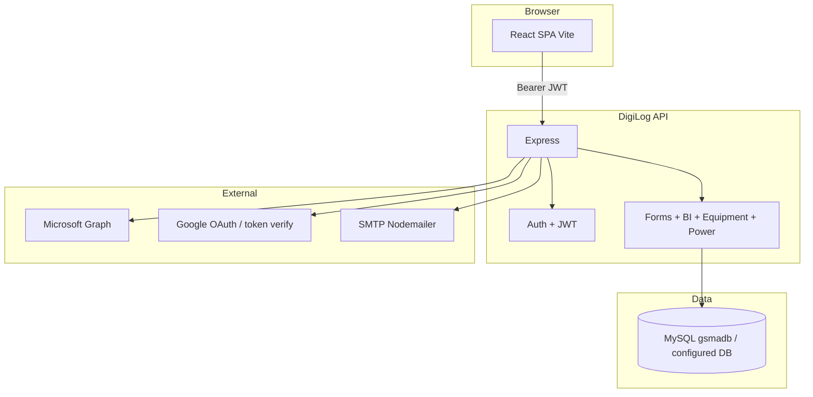
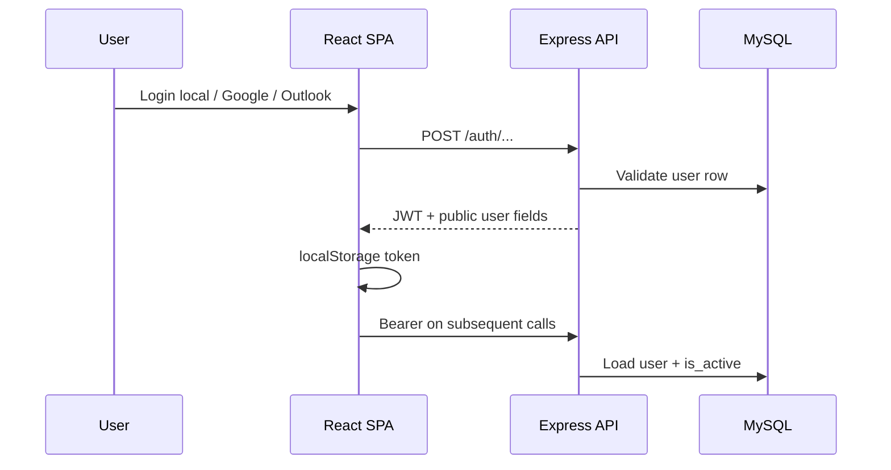

# DigiLog — Technical Documentation

> **Last verified:** 2026-05-18  
> **Repository root:** `DigiLog/` (within workspace `PLANT/`)

## Executive summary

DigiLog is a **plant operations web application**: digital **logbooks** (mill, lab, power, distillery), **EHS** forms, **equipment life-history** cards (mill house and power plant), and a **BI Control Tower** dashboard (e.g. distillery analytics). Users authenticate via **JWT**; **employees** see only **apps and forms** mapped in MySQL; **admins** manage users, mappings, and email. The stack is a **React (Vite) SPA** and an **Express** API backed by **MySQL** (raw `mysql2` pool for most logic; **Prisma** for migrations and an introspected schema).

## System context



## Tech stack

| Layer | Technology | Notes |
|-------|------------|-------|
| Frontend | React 18, Vite 5, React Router 6, Tailwind 3 | `frontend/` |
| Charts / BI UI | Recharts | Distillery analytics dashboard |
| SSO (client) | `@azure/msal-react`, `@react-oauth/google` | Optional MSAL if configured; Google provider if `VITE_GOOGLE_CLIENT_ID` set |
| Backend | Node.js, Express 4 | `backend/server.js` |
| ORM / migrations | Prisma 7 (MySQL) | `prisma/schema.prisma` — models largely `@@ignore` (tables owned by SQL); migrations in `prisma/migrations/` |
| Primary DB access | `mysql2` pool | `config/mysql.js`, controllers |
| Auth | JWT (`jsonwebtoken`), bcrypt (local passwords) | `middleware/auth.js`, `utils/jwt.js` |
| Email | Nodemailer | Admin/user mail when SMTP configured |
| HTTP client | Axios + interceptors | `frontend/src/api/axios.js` |
| CI | TBD — not found in repo | No `.github/workflows` under `DigiLog/` |

## Repository layout

```
DigiLog/
├── backend/           # Express API, Prisma, seeds, scripts
│   ├── config/        # env.js, mysql.js
│   ├── controllers/   # auth, admin, app, form, equipment, power, bi
│   ├── middleware/    # auth, roleCheck, avatarUpload
│   ├── routes/        # REST route modules
│   ├── prisma/        # schema + migrations
│   ├── scripts/       # apply-init-sql, CSV import, etc.
│   └── seed.js        # apps, forms, admin user
├── frontend/          # Vite React SPA
│   └── src/
│       ├── api/       # axios instance
│       ├── components/# Navbar, ProtectedRoute, FormTable, modals…
│       ├── context/   # AuthContext
│       ├── hooks/     # useAuth
│       ├── pages/     # routes: forms, bi, admin, equipment, power, ehs
│       └── config/    # hubFormRoutes, biDashboardRoutes
├── mysql/             # init.sql baseline schema (+ comments for Prisma workflow)
└── docs/              # this file
```

| Path | Responsibility |
|------|----------------|
| `backend/server.js` | Express app, CORS, rate limits, route mount, `/api/health` |
| `backend/controllers/form.controller.js` | Dynamic form submit + `FORM_CONFIG` (table, dedupe pattern) |
| `frontend/src/App.jsx` | All SPA routes |
| `mysql/init.sql` | Canonical MySQL DDL for `gsmadb` and operational tables |
| `frontend/src/config/biDashboardRoutes.js` | BI `form_key` → `/bi/...` paths |

## Local development

### Prerequisites

- **Node.js** (versions consistent with dependencies in `package.json` / lockfiles).
- **MySQL** server.
- Optional: **Azure AD** and **Google Cloud** OAuth app registration for SSO (match env placeholders).

### Setup

1. **Create database** and apply schema per repo practice:
   - Either run `mysql/init.sql` against MySQL (creates `gsmadb` per file), **or** align with your existing DB name.
   - Ensure **`DATABASE_URL`** in `backend/.env` points at the **same database name** the schema uses (`backend/scripts/apply-init-sql.js` documents `gsmadb` vs URL mismatch pitfalls).
2. **Backend:** `cd backend && npm install`
3. **Prisma:** `npm run db:generate` — apply migrations as documented in `mysql/init.sql` header (`db:migrate:dev`, baseline resolve, etc.).
4. **Seed (optional):** `npm run seed` — admin user + apps + forms (see [Seed data](#seed-data)).
5. **Frontend:** `cd frontend && npm install`
6. Copy **`.env.example`** → `backend/.env` and `frontend/.env` (Vite vars). **Do not commit real secrets.**

### Common commands

| Command | Location | Purpose |
|---------|----------|---------|
| `npm run dev` | `backend/` | API with nodemon (`server.js`) |
| `npm run dev` | `frontend/` | Vite dev server (default port 5173) |
| `npm run start` | `backend/` | Production-style `node server.js` |
| `npm run build` / `preview` | `frontend/` | Production build / local preview |
| `npm run seed` | `backend/` | Seed apps, forms, default admin |
| `npm run db:migrate:dev` | `backend/` | Prisma migrate (dev) |
| `npm run db:schema` | `backend/` | Idempotent SQL fixes (`apply-init-sql.js`) |

Default ports from env templates: **API `5000`**, **SPA `5173`**, **`CLIENT_ORIGIN`** must match SPA origin for CORS.

## Configuration

Sourced from `DigiLog/.env.example` and `backend/config/env.js`. **Values are not reproduced here.**

| Variable | Required | Description | Used by |
|----------|----------|-------------|---------|
| `PORT` | No | API port (default 5000) | `config/env.js`, `server.js` |
| `NODE_ENV` | No | Node environment | Express |
| `DATABASE_URL` | Yes (runtime) | MySQL URL for Prisma + pool | Prisma, `config/mysql.js` |
| `MYSQL_*` | Doc / scripts | Discrete MySQL params | `apply-init-sql.js` (if used) |
| `JWT_SECRET` | Yes (auth) | Signing secret | `utils/jwt.js` |
| `JWT_EXPIRES_IN` | No | Token TTL | JWT helper |
| `GOOGLE_CLIENT_ID` | For Google login | Server-side Google token verification | `config/env.js`, `services/google.service.js` |
| `SMTP_*`, `SMTP_FROM` | Optional | Outbound email | Admin mail features |
| `CLIENT_ORIGIN` | Yes (CORS) | Allowed browser origin | `server.js` CORS |
| `APP_LOGO_URL` | Optional | Email logo base URL | Documented in `.env.example` |
| `MONGO_URI` | In example | MongoDB URL | **Not referenced in backend source** — treat as legacy/unused unless wired later |
| `AZURE_*` (server) | Optional | Azure AD app registration | `.env.example`; MSAL uses frontend env — backend Outlook flow uses **Graph with client-supplied access token** |
| `VITE_API_URL` | Recommended | API base (`http://localhost:5000/api` or `/api` behind proxy) | `frontend/src/api/axios.js` |
| `VITE_GOOGLE_CLIENT_ID` | For Google button | Web client ID | `main.jsx`, Google provider |
| `VITE_AZURE_*`, `VITE_REDIRECT_URI` | For MSAL | Azure SPA config | `msalConfig` (see `frontend/src/msalConfig` if present) |

**Note:** `.env.example` shows `MYSQL_DATABASE=gsma_forms` while `mysql/init.sql` uses **`gsmadb`**. The live `DATABASE_URL` database name **must** match the database where tables exist.

## Architecture

### High-level design

The SPA calls **`/api/*`** with **`Authorization: Bearer <jwt>`** after login. The API enforces **authentication** on protected routes and **admin role** on `/api/admin/*`. **Form submission** is generic: `POST /api/forms/:formKey` resolves to a MySQL table and column mapping per `FORM_CONFIG`. **Access** to a form is enforced by **`canAccessForm`** (admin bypass; else `mappings` + optional `mapping_forms`).

### Backend

- **Entry:** `backend/server.js`
- **Routing:** `app.use('/api/<segment>', …)` mounts `routes/*.js`
- **Layers:** Routes → controllers → `mysql2` pool / services (Microsoft Graph, Google verify, avatar files)

Key route files:

- `routes/auth.routes.js` — login, Outlook, Google, `/me`, avatar
- `routes/admin.routes.js` — users, mappings, bulk mail (`authenticate` + `requireRole('admin')`)
- `routes/app.routes.js` — `GET /api/apps` accessible apps for user
- `routes/form.routes.js` — `POST /api/forms/:formKey`, `GET /api/forms/:formKey/records`
- `routes/equipment.routes.js`, `routes/power.routes.js` — CRUD + images + history for equipment modules
- `routes/bi.routes.js` — e.g. `GET /api/bi/distillery-operations`

### Frontend

- **Entry:** `frontend/src/main.jsx` (MSAL optional, Google provider optional, `AuthProvider`, `BrowserRouter`)
- **Routing:** `frontend/src/App.jsx` — public `/login`, `/admin/login`; protected routes under `ProtectedRoute`; admin-only under `requiredRole="admin"`
- **State / auth:** `frontend/src/context/AuthContext.jsx` + `useAuth`
- **API client:** `frontend/src/api/axios.js` — base URL resolution, JWT header, 401 → logout redirect

## Data model

### Overview

- **Engine:** MySQL (InnoDB, utf8mb4).
- **Baseline DDL:** `mysql/init.sql` (creates `users`, `apps`, `forms`, `mappings`, `mapping_forms`, and operational tables such as `mill_logbook1`, `distillery_operations`, EHS tables, etc.).
- **Migrations:** Prisma under `backend/prisma/migrations/`; `schema.prisma` mirrors tables (many models **`@@ignore`** because writes go through raw SQL in `form.controller.js`).
- **MongoDB:** Declared in `.env.example` only — **no `mongoose` usage found** in backend source.

### Core system tables

| Table | Purpose | Key relationships |
|-------|---------|-------------------|
| `users` | Accounts, role, auth provider, profile | Referenced by `mappings` |
| `apps` | Logical products (Mill Logbook, BI Tower, …) | Has many `forms` |
| `forms` | Register each screen/API `form_key` | FK `app_id` → `apps` |
| `mappings` | Employee ↔ app access | `user_id`, `app_id` unique |
| `mapping_forms` | Optional per-form restriction | Empty = all forms in app |

### Operational data

Form payloads land in **per-form MySQL tables** (e.g. `mill_logbook1`, `ds_logbook`, `ph_power`, `distillery_operations`, `ehs_*`). See `FORM_CONFIG` in `controllers/form.controller.js` for **table name**, **deduplication pattern** (A–G on date/shift/time), and **generated column exclusions** for inserts.

### Migrations and seeds

- **Apply SQL baseline:** documented in `mysql/init.sql` header (pipe into `mysql`).
- **Prisma:** `npm run db:migrate:dev` / `db:migrate:deploy`; baseline resolve commands documented in `init.sql`.
- **Seed:** `node seed.js` — creates/updates **admin@gsma.com**, **8 apps**, **forms** including hub + BI keys (`seed.js`).

## API reference (summary)

| Method | Path | Auth | Description |
|--------|------|------|---------------|
| POST | `/api/auth/login` | Public (rate-limited) | Email/password → JWT |
| POST | `/api/auth/outlook` | Public | MS access token → JWT |
| POST | `/api/auth/google` | Public | Google tokens → JWT |
| GET | `/api/auth/me` | Bearer | Current user profile |
| POST/DELETE | `/api/auth/me/avatar` | Bearer | Avatar upload/delete |
| GET | `/api/apps` | Bearer | Apps visible to user |
| POST | `/api/forms/:formKey` | Bearer | Submit form body → configured table |
| GET | `/api/forms/:formKey/records` | Bearer | List records (controller-defined) |
| GET | `/api/bi/distillery-operations` | Bearer + form access | Distillery BI JSON (`bi.controller.js`) |
| GET/POST/PUT/DELETE | `/api/equipment/*`, `/api/power/*` | Bearer | Equipment cards + history + images |
| GET/POST/PUT/DELETE | `/api/admin/*` | Bearer + **admin** | Users, mappings, mail, apps-all |
| GET | `/api/data-upload/access` | Bearer | Whether Data Upload tab is enabled |
| GET/POST/DELETE | `/api/data-upload`, `/api/data-upload/files` | Bearer + data upload access | List/upload/delete CSV/Excel (disk: `uploads/data-ingestion/`) |
| GET | `/api/data-upload/files/:id/download` | Bearer + access | Download stored file |
| GET/PUT | `/api/admin/data-upload-access` | Bearer + **admin** | Grant/revoke employee Data Upload tab |

Full detail: read `backend/routes/*.js` and matching `controllers/*.js`.

## Frontend structure and routing

| Area | Pattern | Notes |
|------|---------|--------|
| Forms hub | `/forms-hub`, `/apps/:appId` | `Dashboard.jsx`, `AppDetail.jsx`, `FormTable.jsx` |
| GSMA forms | `/forms/<logical path>` | See `App.jsx` imports — keys align with `form_key` / URLs |
| Hub modules | `/equipment`, `/power`, `/ehs` | `hubFormRoutes.js` maps special `form_key`s |
| BI | `/bi`, `/bi/distillery-operations` | `biDashboardRoutes.js` maps `bi_distillery_operations` |
| Admin | `/admin/employees`, `/admin/login` | Employee + mapping management |
| Data upload | `/data-upload` | CSV/Excel ingestion (admin always; employees if granted) |
| Auth | `/login` | JWT stored `localStorage.token` |

**Main user journey (employee):** Login → Home / Forms Hub → pick app → open form or hub link → submit (optional **review modal** on GSMA forms) → data in MySQL.

## Authentication and authorization



- **Roles:** `admin` | `employee` (`users.role`).
- **Form access:** `canAccessForm` in `form.controller.js` (reused by BI) — mapping to **app** required; **mapping_forms** may restrict to subset.
- **CORS:** Single `CLIENT_ORIGIN` with credentials.
- **Rate limit:** Global + stricter window on `/api/auth/login`.

## Integrations

| Integration | Purpose | Config (names only) | Code |
|-------------|---------|---------------------|------|
| Microsoft / Entra | SPA obtains token; API calls Graph | MSAL + Vite Azure IDs | `microsoft.service.js`, `AuthContext` redirect handling |
| Google Sign-In | ID/access token → profile → JWT | `GOOGLE_CLIENT_ID`, `VITE_GOOGLE_CLIENT_ID` | `google.service.js`, `Login` / `GoogleSignInButton` |
| SMTP | Admin notifications / mail | `SMTP_*` | Admin controller / mail util (see repo) |

## Deployment and operations

- **Static hosting + API:** Build `frontend` (`npm run build`); serve `dist/` behind reverse proxy; proxy `/api` to Node on `PORT` or set `VITE_API_URL` to full public API URL.
- **Health:** `GET /api/health` → `{ status: 'ok' }`.
- **Uploads:** `server.js` serves `uploads/` statically — ensure directory exists and is backed up in production.
- **TBD:** No Dockerfile or K8s manifests found under `DigiLog/`.

## Testing and CI

- **Automated tests:** **TBD — not found** (no Jest/Vitest/Cypress scripts in `package.json` files reviewed).
- **Manual:** Use seeded admin, map a test employee, exercise forms and BI.

## Form catalog (form_key → feature)

| form_key | Feature |
|----------|---------|
| `mill_logbook1`–`3`, `mill_stoppages` | Mill logbooks |
| `ds_logbook`, `rs_logbook`, `ops_logbook`, `sa_logbook`, `syrp_logbook`, `stoppage_logbook` | Lab logbooks |
| `ph_power`, `ph_steam`, `ph_stoppage` | Power logbooks |
| `distillery_ops` | Distillery daily operations form |
| `ehs_near_miss`, `ehs_water_gwa`, `ehs_water_etp`, `ehs_water_cpu` | EHS |
| `digilog_hub_mill_equipment`, `digilog_hub_power_equipment`, `digilog_hub_ehs` | Hub entry routes |
| `bi_distillery_operations` | Distillery analytics dashboard access |

## Known gaps / TBD

- **MongoDB / `MONGO_URI`:** Present in `.env.example` but **no server usage** located — clarify or remove to avoid confusion.
- **Example DB name mismatch:** `gsma_forms` vs `gsmadb` in docs vs `init.sql` — align env with real DB.
- **CI/CD:** No pipeline files under `DigiLog/` in this review.
- **Automated tests:** None documented in package scripts.

## Glossary

| Term | Meaning in DigiLog |
|------|-------------------|
| **form_key** | Stable string identifying a form API + DB mapping (`forms.form_key`, URL segment for `/api/forms/:formKey`) |
| **App** | Grouping of forms (`apps` table); shown in Forms Hub |
| **Mapping** | Which employee can access which app (`mappings`) |
| **Hub form** | Synthetic form that navigates to `/equipment`, `/power`, or `/ehs` |
| **BI dashboard form** | Synthetic form opening `/bi/...` instead of `/forms/...` |
| **GSMA** | Plant naming used in UI copy for mill/lab/power/distillery logbooks |

---

## Appendix — related files

- [Backend entry](../backend/server.js)
- [Form controller + access rules](../backend/controllers/form.controller.js)
- [SPA routes](../frontend/src/App.jsx)
- [Environment template](../.env.example)
